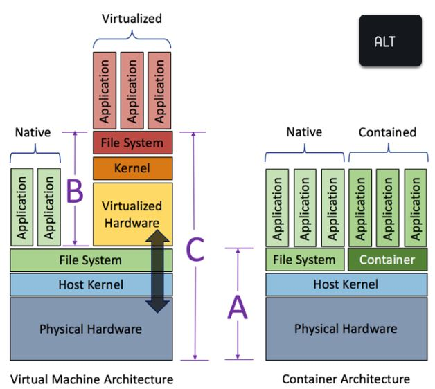

# Singularity 컨테이너

싱귤레러티(Singularity)는 도커(Docker)와 같이 OS 가상화를 구현하기 위한 HPC 환경에 적합한 컨테이너 플랫폼이다. 사용자 작업 환경에 적합한 리눅스 배포판, 컴파일러, 라이브러리 등을 포함하는 컨테이너 이미지를 생성하고 컨테이너를 구동하여 사용자 프로그램을 실행할 수 있습니다.


<div align="left"><figure><figcaption></figcaption></figure> <figure><figcaption></figcaption></figure></div>

&#x20;                 < 가상머신과 컨테이너 아키텍처 비교>                              \<Singularity 컨테이너 아키텍처>

※ 가상머신은 애플리케이션이 하이퍼바이저와 게스트 OS를 거쳐 올라가는 구조이나, 컨테이너는 물리적인 하드웨어에 더 가까우며 별도의 게스트 OS가 아닌 호스트 OS를 공유하기 때문에 오버헤드가 더 작습니다. 최근 클라우드 서비스에서 컨테이너의 활용이 증가하고 있습니다.


## 가. 컨테이너 이미지 빌드하기

### 1. 싱귤레러티 모듈 적재 혹은 경로 설정

```
$ module load singularity/3.11.0
or
$ $HOME/.bash_profile
export PATH=$PATH:/apps/applications/singularity/3.11.0/bin/
```

### 2. 로컬 빌드

* 누리온 시스템의 로그인 노드에서 컨테이너 이미지를 로컬 빌드하기 위해서는, 먼저 [**KISTI 홈페이지 > 기술지원 > 상담신청**을](https://www.ksc.re.kr/gsjw/gsjw/qna/edit) 통해 아래와 같은 내용으로 fakeroot 사용 신청을 해야합니다.
  * 시스템명 : 누리온
  * 사용자 ID : a000abc
  * 요청사항 : 싱귤레러티 fakeroot 사용 설정

```
$ singularity [global options...] build [local options...] ＜IMAGE PATH＞ ＜BUILD SPEC＞

[주요 global options]
    -d : 디버깅 정보를 출력
    -v : 추가 정보를 출력
    --version : 싱귤레러티 버전 정보를 출력

[관련 주요 local options]
    --fakeroot : roor 권한 없이 일반사용자가 가짜 root 사용자로 이미지 빌드 
    --remote : 외부 싱귤레러티 클라우드(Sylabs Cloud)를 통한 원격 빌드(root 권한 필요 없습니다)
    --sandbox : 샌드박스 형태의 쓰기 가능한 이미지 디렉터리 빌드

＜IMAGE PATH＞
   default : 읽기만 가능한 기본 이미지 파일(예시 : ubuntu1.sif)
   sandbox : 읽기 및 쓰기 가능한 디렉터리 구조의 컨테이너(예시 : ubuntu4) 

＜BUILD SPEC＞
definition file : 컨테이너를 빌드하기 위해 recipe를 정의한  파일(예시 : ubuntu.def)
local image : 싱귤레러티 이미지 파일 혹은 샌드박스 디렉터리(IMAGE PATH 참조)
URI 
library:// 컨테이너 라이브러리 (default https://cloud.sylabs.io/library) 
docker:// 도커 레지스트리 (default 도커 허브)
docker-archive:// 도커 아카이브 파일
shub:// 싱규레러티 레지스트리 (default 싱귤레러티 허브)
oras:// OCI 레지스트리
oci-archive:// OCI 아카이브 파일
```

```
① Definition 파일로부터 ubuntu1.sif 이미지 빌드하기
 $ singularity build --fakeroot ubuntu1.sif ubuntu.def* 

② 싱규레러티 라이브러리로부터 ubuntu2.sif 이미지 빌드하기
 $ singularity build --fakeroot ubuntu2.sif library://ubuntu:18.04 

③ 도커 허브로부터 ubuntu3.sif 이미지 빌드하기
 $ singularity build --fakeroot ubuntu3.sif docker://ubuntu:18.04 
 
④ 도커 허브로부터 intel 아키텍처에 최적화된 pytorch 이미지 빌드하기 
 $ singularity build --fakeroot pytorch1.sif docker://intel/intel-optimized-pytorch:2.3.0-pip-multinode

⑤ 도커 tar 파일로부터 pytorch.sif 이미지 빌드하기
 $ singularity build --fakeroot pytorch.sif docker-archive://pytorch.tar

⑥ Definition 파일로부터 intel 아키텍처에 최적화된 pytorch 이미지 빌드하기
 $ singularity build --fakeroot pytorch2.sif pytorch.def**
 
⑦ fakeroot 사용하지 않고 Definition 파일로부터  ubuntu4.sif 이미지 빌드하기
   # singularity 3.11.0 버전 이상에서 지원
   # Definition 파일에서 기존 컨테이너 이미지 기반 패키지 설치에 적합하며,     
     apt-get과 같은 시스템패키지 관리자를 사용하는 경우 일부 패키지(git 등) 설치 과정에서 에러가 
     발생할 수 있습니다
 $ singularity build ubuntu4.sif ubuntu.def*
 
* ) ubuntu.def 예시
 bootstrap: docker
 from: ubuntu:18.04
 %post
 apt-get update
 apt-get install -y wget bash gcc gfortran g++ make file
 %runscript
 echo "hello world from ubuntu container!"

** ) pytorch.def 예시
 # 로컬 이미지 파일로부터 콘다를 사용하여 새로운 패키지 설치를 포함한 이미지 빌드
 bootstrap: localimage
 from: pytorch1.sif
 %post
 pip install scikit-image
 
 # 도커 허브에서 사용하여 새로운 패키지 설치를 포함한 이미지 빌드
 bootstrap: docker
 from: intel/intel-optimized-pytorch:2.3.0-pip-multinode
 %post
 pip install scikit-image
```

### **3. 원격 빌드**

```
 $ singularity build --remote ubuntu4.sif ubuntu.def 
 (Sylabs Cloud에서 제공하는 원격 빌드 서비스 이용하여 Definition 파일로부터ubuntu4.sif 이미지 빌드하기)
```

※ Sylabs Cloud(https://cloud.sylabs.io)에서 제공하는 원격빌드 서비스를 이용하려면 액세스 토큰을 생성하여 뉴론 시스템에 등록해야 합니다 [**\[참조 1\]**](appendix-3-how-to-use-singularity-container.md#id-1-sylabs-cloud)

※ 또한, Sylabs Cloud에 웹 브라우저 접속을 통해서 싱귤레러티 컨테이너 이미지의 생성∙관리가 가능합니다.  [**\[참조 2\]**](appendix-3-how-to-use-singularity-container.md#id-2-2)

### 4. 컨테이너 이미지 가져오기/내보내기

```
$ singularity pull tensorflow.sif library://dxtr/default/hpc-tensorflow:0.1 (Sylabs cloud 라이브러리에서 컨테이너 이미지 가져오기)
$ singularity pull tensorflow.sif docker://tensorflow/tensorflow:latest (도커 허브에서 이미지를 가져와서 싱귤레러티 이미지로 변환)
$ singularity push -U tensorflow.sif library://ID/default/tensorflow.sif (Sylabs Cloud 라이브러리에 싱귤레러티 이미지 내보내기(업로드))
```

※ Sylabs Cloud(https://cloud.sylabs.io)에 이미지를 내보내기(업로드) 위해서는 액세스 토큰을 생성하여 누리온에 등록해야 합니다. [**\[참조 1\]**](appendix-3-how-to-use-singularity-container.md#id-1-sylabs-cloud)


## 다. 싱귤레러티 컨테이너에서 사용자 프로그램 실행

### **1. 싱귤레러티 모듈 적재 혹은 경로 설정**

```
$ module load singularity/3.11.0
or
$ $HOME/.bash_profile
export PATH=$PATH:/apps/applications/singularity/3.11.0/bin/
```

### **2. 싱귤레러티 컨테이너에서 프로그램 실행 명령어**

```
$ singularity [global options...] shell [shell options...] ＜container＞
$ singularity [global options...] exec [exec options...] ＜container＞ ＜command＞
$ singularity [global options...] run [run options...] ＜container＞
```

```
① 싱귤레러티 컨테이너에서 쉘 실행 후 사용자 프로그램 실행 
$ singularity shell pytorch1.sif
Singularity> python test.py

② 싱귤레러티 컨테이너에서 사용자 프로그램 실행
$ singularity exec pytorch1.sif python test.py 
$ singularity exec docker://intel/intel-optimized-pytorch:2.3.0-pip-multinode python test.py
$ singularity exec library://dxtr/default/hpc-tensorflow:0.1 python test.py

③ 싱귤레러티 컨테이너에서 runscript(이미지 빌드 시 생성)가 존재하면 이 스크립트를 실행하고,    
   runscript가 존재하지 않고 컨테이너 뒤에 사용자 명령어를 입력하면 해당 명령어가 실행됩니다.
$ singularity run ubuntu1.sif 
hello world from ubuntu container!

$ singularity run pytorch1.sif python test.py 

```

### **3. 스케줄러(PBS)를 통한 컨테이너 실행 방법**

#### **1) 작업 스크립트를 작성하여 배치 형태 작업 실행**

* 실행 명령어 : qsub＜작업 스크립트 파일＞

```
[id@login01]$ qsub job_script.sh
14954055.pbs
```

※ 자세한 스케줄러(PBS) 사용 방법은 "[**누리온 지침서-스케줄러(PBS)를 통한 작업실행**](../undefined/running-jobs-through-scheduler-pbs.md)" 참조바랍니다.

#### **2) 작업 스크립트 파일 예시**&#x20;

* **Serial 작업**  &#x20;

&#x20;      \* 실행명령어 : singularity run <컨테이너> \[사용자 프로그램 실행 명령어]


```
#!/bin/sh
#PBS -N openfoam
#PBS -q normal
#PBS -A openfoam
#PBS -V
#PBS -j oe
#PBS -W sandbox=PRIVATE
#PBS -m e
#PBS -M wjnadia@kisti.re.kr
#PBS -r y
#PBS -l select=1:ncpus=1:mpiprocs=1:ompthreads=1
#PBS -l walltime=00:30:00

cd $PBS_O_WORKDIR
module load singularity/3.11.0 
cd cavity
singularity run openfoam-default:2312.sif icoFoam
```


* **병렬 작업(OpenMPI)**

&#x20;     \* 실행 명령어 : mpirun singularity run  <컨테이너> \[사용자 프로그램 실행 명령어]


```
#!/bin/sh
#PBS -N openfoam
#PBS -q normal
#PBS -A openfoam
#PBS -V
#PBS -j oe
#PBS -W sandbox=PRIVATE
#PBS -m e
#PBS -M wjnadia@kisti.re.kr
#PBS -r y
#PBS -l select=2:ncpus=64:mpiprocs=64:ompthreads=1
#PBS -l walltime=00:30:00

cd $PBS_O_WORKDIR
module load singularity/3.11.0 gcc/8.3.0 openmpi/3.1.0
cd cavity
mpirun singularity run openfoam-default:2312.sif icoFoam
```


※ 2노드 점유, 노드 당 64 타스크(총 128개 MPI 프로세스) 사용 예제

#### **3) 스케줄러가 할당한 계산 노드에서 인터랙티브 작업 실행**

* &#x20;병렬프로그램(OpenMPI) 실행 예시


```
[id@login01]$ qsub -I -l select=2:ncpus=64:mpiprocs=64:ompthreads=1 -l walltime=00:30:00 -q normal  -A openfoam
qsub: waiting for job 14954204.pbs to start
qsub: job 14954204.pbs ready

[id@node1000]$ 
[id@node1000]$ module load singularity/3.11.0 gcc/8.3.0 openmpi/3.1.0
[id@node1000]$ cd cavity
[id@node1000]$ mpirun singularity run openfoam-default:2312.sif icoFoam 
```


* &#x20;텐서플로우 프로그램 실행 예시

```shell-session
$ qsub -I -V -l select=1:ncpus=68:ompthreads=68 \
-l walltime=12:00:00 -q normal -A tf

$ export OMP_NUM_THREADS=68; singularity exec tensorflow-1.12.0-py3.simg python convolutional.py
```

※ 예제 싱귤레러티 이미지 파일 위치: /apps/applications/tensorflow/1.12.0/tensorflow-1.12.0-py3.simg

※ 예제 convolutional.py 위치: /apps/applications/tensorflow/1.12.0/examples/convolutional.py

##

## 라. 참조

### \[참조 1] Sylabs Cloud 액세스 토큰 생성 및 누리온에 등록하기


### \[참조 2] 웹 브라우저에서 리모트 빌더에 의한 싱규레러티 컨테이너 이미지 빌드하기


_※ 누리온에서 singularity 명령어로 리모트 빌드한 이미지 목록도 포함됩니다._



2023년 3월 2일에 마지막으로 업데이트 되었습니다.

