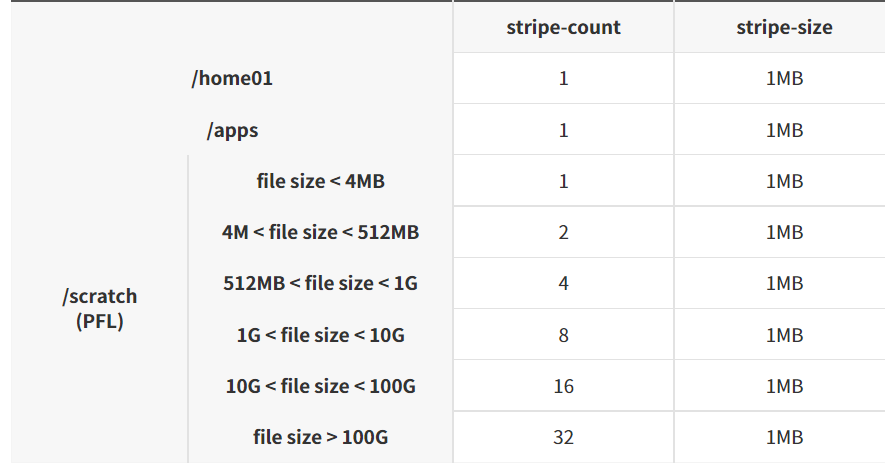
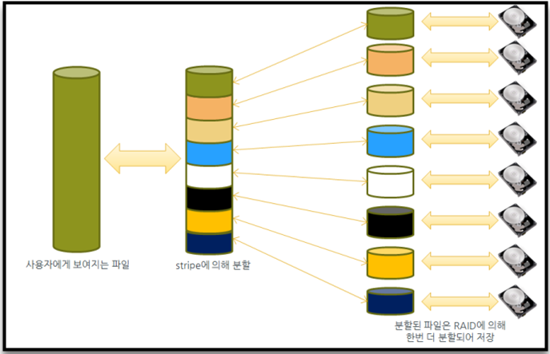

# Lustre stripe

## 가. 5호기 Lustre Striping 기본 설정

5호기 Lustre File System은 File Striping을 지원하며, 이를 위해 복수 개의 OST(Object Storage Target, 즉 물리적으로 분산되어 있는 여러 디스크)에 하나의 파일을 분산시켜 저장 함으로써 병목을 줄이고 I/O 성능을 향상시킬 수 있습니다. 특히, Lustre 2.10부터 지원되는 PFL(Progressive File Layout)이 /scratch 파일시스템에 적용되어 있습니다. 이 기능은 사용자 별도의 striping 설정 없이 파일의 크기에 따라 stripe-count 개수가 자동으로 적용되어 I/O의 성능을 향상시킬 수 있습니다. Nurion 파일 시스템의 striping 설정은 아래와 같습니다.



## 나. Lustre Striping 개념



Lustre는 각 OST별로 자료를 분할하여 대용량 파일에 대한 I/O 성능을 최대화 할 수 있으며, 병렬화가 유효한 최대 분할 수는 OST 숫자와 같습니다. 단일 파일 역시 위 그림과 같이 Lustre Striping 기능을 사용하여 OST에 병렬로 저장합니다.


## 다. stripe 설정 및 확인

```shell-session
$ lfs setstripe [--stripe-size|-s size] [--stripe-count|-c count] filename|dirname
```

* 파일 또는 디렉터리에 striping 설정을 적용시키는 명령어 입니다.  위 명령으로 생성된 파일이나 위 명령이 적용된 디렉터리에서 생성되는 모든 파일은 striping 설정 적용합니다.
  * \--stripe-size
    * 각 OST에 저장할 데이터의 크기를 설정
    * 지정된 크기만큼 저장하면 다음 OST에 데이터를 저장
    * 기본 값은 1MB이며 stripe\_size를 0으로 설정하면 기본 값을 사용합니다.
    * stripe\_size는 반드시 64KB의 배수로 설정해야 하며 4GB보다 작아야 합니다.
  * \--stripe-count
    * Striping에 사용할 OST 개수를 설정
    * 기본 값은 1이며 stripe\_count를 0으로 설정하면 기본 값을 사용
    * stripe\_count가 -1이면 가능한 모든 OST들을 사용

```shell-session
$ lfs getstripe filename|dirname
```

* 파일 또는 디렉터리에 적용된 striping 설정 값을 확인하는 명령어


## 라. 권장사항 및 팁

* 작업 스크립트 내에서 모델의 결과파일이 저장될 디렉터리에 대해 setstripe를 지정하면, 이후 생성되는 하위 디렉터리 및 파일은 모두 해당 설정 값 상속됩니다.
* \--stripe-count는 파일 사이즈가 1GB 이상인 파일에 대해 4로 설정 시 대부분 성능 향상됩니다.  더 큰 값 사용 시 테스트 필요합니다.
* \--stripe-size는 파일 사이즈가 수 TB 이상인 파일인 경우에만 유효하므로 대부분 default 값을 사용해도 문제 없습니다.


2022년 9월 22일에 마지막으로 업데이트 되었습니다.

