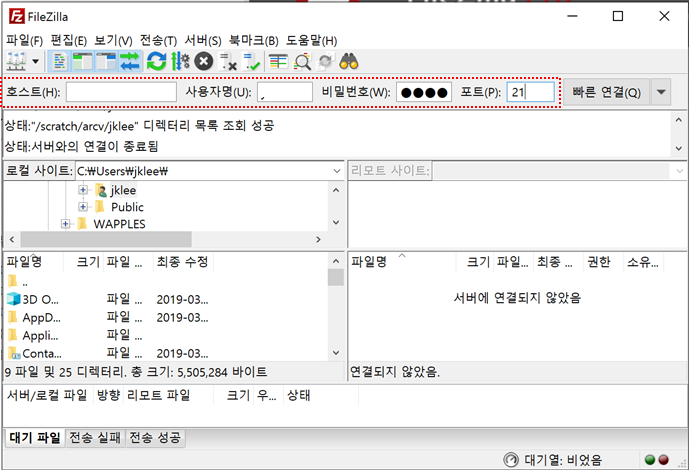
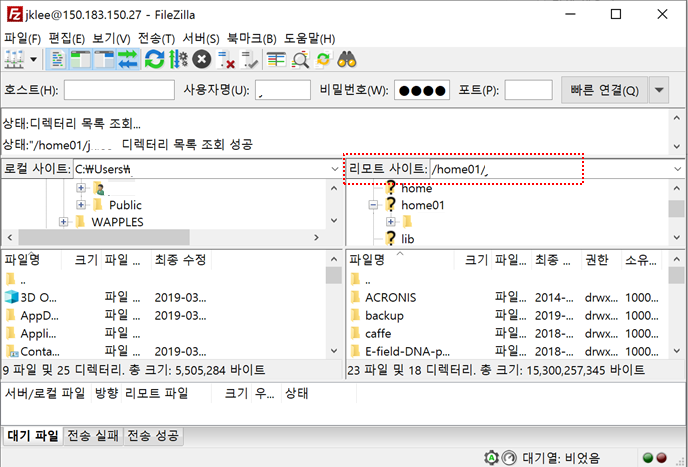
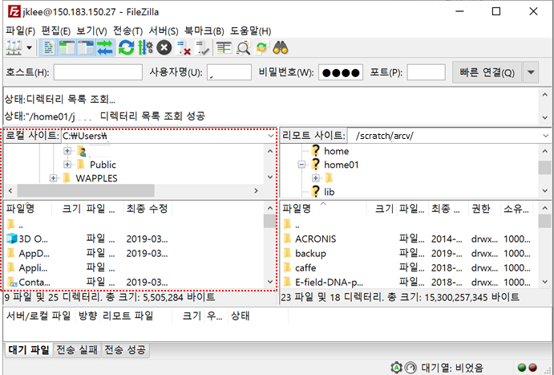
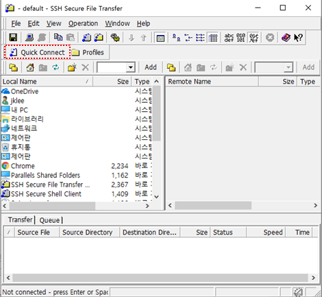
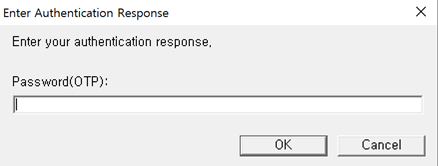
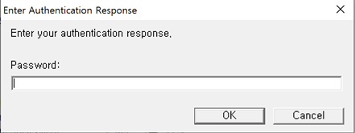

# 데이터 아카이빙

 

## 가. 시스템 환경 및 사용 신청

누리온은 사용자의 중요 파일 및 대용량 파일의 장기간(계약 만료 후 1년) 보관을 지원하기 위하여 10PBytes의 테이프(Tape) 라이브러리(IBM TS4500)를 운영합니다.

TSMSF(Tiered Storage Management Script Facility)는 사용자의 데이터 백업 및 아카이빙을 지원하기 위한 소프트웨어로 누리온의 Datamover 노드에 설치되어 운영되고 있습니다. TSMSF는 사용자 데이터를 자동으로 아카이빙하고 사용자가 데이터를 필요로 할 때 수동으로 복원(restore)할 수 있도록 지원을 합니다. 이는 관리자에 의해 정기적으로 이루어지는 사용자 홈 디렉터리(/home01) 백업과는 달리 사용자가 직접 파일을 특정 디렉토리(/scratch/arcv/\[$USER])에 업로드(upload)하는 방식으로 이루어집니다. 현재 TSMSF는 그림과 같이 테이프(Tape) 라이브러리, Datamover(DM) 노드로 구성됩니다.

* **누리온 시스템 TSMSF : 테이프(10PB)**
* **누리온 시스템 Datamover 노드: nurion-dm.ksc.re.kr**

![\[ TSMSF 시스템 구성도 \]](<../.gitbook/assets/TSMSF 시스템 구성도 .dib>)

사용자가 파일을 Datamover에서 지정된 디렉토리(/scratch/arcv/$USER)로 업로드(upload)하고 7일(추후 변경가능)이 지나면 데이터는 자동으로 아카이빙(Archiving)이 진행됩니다. Datamover로 파일을 업로드 할 경우에는 FTP, SCP, SSH, SFTP 등을 이용하여 외부에서 직접 파일을 업로드 할 수 있고, 누리온 로그인 노드(단, 로그인노드의 경우 FTP 사용 불가)를 통해서도 가능합니다. 이 때, FTP를 제외한 서비스는 일회용패스워드(OTP)를 입력해야 합니다. 또한 FTP를 제외한 서비스는 제한된 자원(CPU 시간 10분)을 소진하게 되면 자동으로 파일 업로드가 중단되니 FTP를 이용하여 파일을 업로드 권장합니다.


## 나. 사용자 정책 및 신청 방법

TSMSF에 저장할 수 있는 용량은 계정(ID)당 100TB(파일수는 최대 1,000,000개)이며, 보존기간은 사용자의 계정 사용 종료 후 1년까지입니다.

TSMSF는 기본적으로 테이프 미디어를 이용하므로 <mark style="color:red;">테이프 미디어의 장애시 복구가 어려울 수 있습니다.</mark> 따라서 <mark style="color:red;">중요 데이터는 사용자 로컬 시스템에 반드시 백업 및 보관 권장합니다.</mark>

또한 테이프 미디어는 접근(Access)을 위하여 테이프 라이브러리로 로딩(Loading)할 때, 일반적으로 많은 시간이 소요되므로 백업/아카이빙 하고자 하는 파일들이 source 파일과 같이 작은 파일들이 많은 경우 tar 및 gzip 등을 통해 압축하여 보관 권장합니다.

<mark style="color:red;">**TSMSF를 사용하기 위해서는 별도의 사용 환경 구성이 필요하므로 account@ksc.re.kr 메일로 신청 바랍니다.  별도의 양식은 필요하지 않으며 계정정보(ID)를 적어 신청 바랍니다.**</mark>

그 외의 일반적인 기술 지원 관련 문의는 consult@ksc.re.kr 메일 또는 [기술지원](https://www.ksc.re.kr/gsjw/gsjw/qna)을 통해 문의 바랍니다.


## 다. 아카이빙 방법

### **1. 로그인 노드 및 Datamover 노드 접속**

사용자 데이터 아카이빙을 위해서는 누리온 시스템의 로그인 노드나 Datamover 노드를 활용 바랍니다. 주의할점은 최초 로그인시 디렉토리 위치는 ‘/home01/$USER’로 이는 TSMSF 내의 홈 디렉터리가 아니라 누리온 시스템의 일반적인 홈 디렉터리입니다. 따라서 cd 명령어(cd /scratch/arcv/$USER)로 경로를 변경하여 TSMSF를 위한 사용자 디렉터리로 이동  바랍니다.

#### (방법1) 로그인 노드(nurion.ksc.re.kr)나 Datamover 노드(nurion-dm.ksc.re.kr)에 접속(ssh)하여 cp 사용

```shell-session
[user01@dm2:/home01/user01 ]$ ssh $USER@nurion-dm.ksc.re.kr (또는 ssh $USER@nurion.ksc.re.kr)
 Password(OTP):
 Password:

[user01@dm02:/home01/user01 ]$ cp –r [mydir | myfile] /scratch/arcv/$USER/
```

#### (방법2) 원격에서 scp 사용

```shell-session
[user01@login01:/home01/user01 ]$ scp –r [mydir | myfile] $USER@nurion-dm.ksc.re.kr:/scratch/arcv/$USER/
Password(OTP):
Password:
```

#### (방법3) FTP / SFTP 클라이언트 프로그램을 이용하여 Datamover 노드(nurion-dm.ksc.re.kr) 접속하여 파일 업로드

#### 1) 파일질라(FileZilla) 클라이언트를 이용한 예제(FTP)

* Datamover 노드에 접속하기 위한 정보를 입력하고 빠른 ‘연결 버튼’을 클릭

| 호스트                 | 사용자명           | 비밀번호     | 포트 |
| ------------------- | -------------- | -------- | -- |
| nurion-dm.ksc.re.kr | USER ID(사용자계정) | 사용자 비밀번호 | 21 |




* 리모트 사이트의 경로가 사용자 홈 디렉토리(/home01/$USER) 이므로 지정된 디렉토리(/scratch/arcv/$USER)로 이동

※ 리모트 사이트 경로에 직접 절대경로를 입력하면 쉽게 이동 가능



* 왼쪽 로컬 사이트에서 파일이나 디렉터리를 선택하여 파일 업로드



※ 보다 상세한 파일질라 매뉴얼은 사이트(https://filezilla-project.org/) 참조

#### 2) SSH Secure Shell Client를 이용한 예제(SFTP)

* Datamover 노드에 접속하기 위해서‘Quick Connect’ 버튼 클릭



* Datamover 노드에 접속하기 위한 정보를 입력하고 ‘연결(Connect)’ 버튼 클릭

| 호스트                 | 사용자명           | 포트 | 인증방법                 |
| ------------------- | -------------- | -- | -------------------- |
| nurion-dm.ksc.re.kr | USER ID(사용자계정) | 22 | Keyboard Interactive |


.dib>)

* 일회용패스워드(OTP)와 비밀번호(Password)를 순차적으로 입력하고 ‘OK’ 버튼 클릭





* 오른쪽 사이트의 경로가 사용자 홈 디렉토리(/home01/$USER) 이므로 지정된 디렉터리(/scratch/arcv/$USER)로 이동

※ 해당 경로에 직접 절대 경로를 입력하면 쉽게 이동 가능

.dib>)

* 왼쪽 로컬 사이트에서 파일이나 디렉터리를 선택하여 파일 업로드

.dib>)

### **2. 데이터 아카이빙**

지정된 디렉터리(/scratch/arcv/$USER) 내 파일 중 크기가 10Mbytes 이상이고 3일 동안(추후 변경예정) 접근하지 않은 파일은 자동으로 아카이빙이 진행되며, 아카이빙이 진행된 파일은 다음과 같이 파일 사이즈 0인 임시파일(chunk file)만 해당 디렉토리에 존재하고 실제 데이터는 테이프 라이브러리에 존재하게 됩니다. 파일의 개수가 많아지면 테이프 라이브러리로 아카이빙을 진행할 때나 파일 사용을 위해 디스크로 복구하는데 시간이 더 걸리게 되므로 가능하면 압축(tar 등)하여 파일 개수를 줄일 것을 권장합니다.

```shell-session
[user01@dm2 ~] ls –lh /scratch/arcv/$USER/*
... 생략 ...
-rw-r--r-- 1 root root 0 Feb 5 18:51 2019-2-19-18-51.[File Name].archived
... 생략 ...
```


```shell-session
# ls -l /scratch/arcv/testdir/
total 2744320
-rw-r--r-- 1 root root 0 Feb 25 20:48 2019-2-25-20-48.test.220M.archived
-rw-r--r-- 1 root root 0 Feb 25 20:48 2019-2-25-20-48.test.230M.archived
-rw-r--r-- 1 root root 104857600 Sep 27 14:54 test.100M
-rw-r--r-- 1 root root 10485760 Sep 27 14:54 test.10M
-rw-r--r-- 1 root root 115343360 Sep 27 14:54 test.110M
... 생략 ...
```


### **3. 아카이빙 된 파일의 세부정보 확인**

아카이빙 된 자료는 arc\_ls 명령어를 통해 다음과 같이 파일의 세부정보를 확인할 수 있습니다.

```shell-session
# arc_ls /scratch/arcv/testdir/
DIR: /scratch/arcv/testdir
ARC: /scratch/arcv/testdir/2019-2-25-20-48.test.460M.archived
- File to restore : /scratch/arcv/testdir/test.460M
- File owner : 0
- File group : 0
- File size : 482344960
- Archived Name : 3_7_4_6_scratcharcvtestdirtest.460M
- Archived time : 1551095210
NRM: /scratch/arcv/testdir/test.10M
... 생략 ...
```

arc\_ls 명령어는 디렉터리나 파일의 상대경로 또는 절대경로를 인자로 줄 수 있고 필요시 –r 옵션을 통해 지정된 디렉터리 내 하위 경로를 탐색할 수 있습니다. 출력 결과에서 DIR은 디렉터리 의미하며 NRM은 일반 파일, ARC는 아카이빙 된 파일을 의미합니다.


## 라. 복원(Restore) 방법

아카이빙된 데이터를 사용하기 위해서는 복원을 진행해야 합니다. 파일 복원을 위해서 제공하는 명령어는 arc\_restore입니다. 이때 <mark style="color:red;">테이프 라이브러리에서 데이터 파일을 가져오므로 많은 시간이 소요됩니다.</mark> 다음과 같이 아카이빙된 파일을 복원할 수 있습니다.

```shell-session
[user01@dm2 ~] arc_restore /scratch/arcv/$USER/[*.archived]
... 생략 ...
-rw-r--r-- 1 root root 200M Feb 5 18:51 [original file]
... 생략 ...
```


```shell-session
# arc_restore arc_restore /scratch/arcv/testdir/2019-2-25-20-49.test.580M.archived
ARCRESTORE : start to find archived files.
Processing restore queue...
[207249:207265] resRunner : filecheck : ADD : 1/0/0 : /scratch/arcv/testdir/test.580M
[207265:207269] Process ID 207269 started for restoring...
[207265:207269] File to restore : /scratch/arcv/testdir/test.580M
[207265:207269] File owner : 0
[207265:207269] File group : 0
[207265:207269] File size : 608174080
[207265:207269] Archived Name : 3_7_4_6_scratcharcvtestdirtest.580M
[207265:207269] Archived time : 1551095339
[207265:207269] Restore started at : Thu Feb 28 12:16:43 2019
[207265:207269] restoreFile : sh PTLGet -p 3_7_4_8_scratcharcvtestdirtest.580M -d /scratch/arcv/testdir -t 1551095339
[207265:207269] restoreFile : move /scratch/arcv/testdir/.working/3_7_4_6_scratcharcvtestdirtest.580M to /scratch/arcv/testdir/test.580M
[207265:207269] restoreFile : unlink /scratch/arcv/testdir/2019-2-25-20-49.test.580M.archived
[207265:207269] restoreFile : dbupdate( ARCHIVED_FILES / last_mod=1551323868,restore_count=1,status_id=1,result_id=1 Where file_id=341 )
[207265:207269] Restoring was done : /scratch/arcv/testdir/test.580M
[207249:207265] resRunner : CProc was forked : CProc count=1, CProc tCount=1
[207249:207265] resRunner : [ success=1 / fail=0 ] 207269 was finished : Success
resRunner : REPORT : resresult : Success=1 / Fail=0
Main thread runtime = 00:01:05
```


arc\_restore 명령어는 arc\_ls 명령어와 마찬가지로 디렉토리나 파일의 상대경로 또는 절대경로를 인자로 줄 수 있고, 필요시 –r 옵션을 통해 지정된 디렉토리 내의 하위 경로를 탐색할 수 있습니다. 또한, 파일 지정 시 chunk 파일명(timestamp.\[File Name].archived)과 원본 파일명을 모두 지정 가능하여, 두 가지 중 하나를 선택하여 사용할 수 있습니다.


## 마. 삭제(Delete) 방법

지정된 디렉토리(/scratch/arcv/$USER) 내 파일 중 일부, 혹은 전체를 삭제하기 원한다면 Linux 기본 명령어인 rm 명령어를 사용할 수 있습니다.

임시파일(chunk file, 확장자 .archived) 역시 rm 명령어를 사용하여 삭제하면 되며, 임시파일 삭제 시 테이프라이브러리로 아카이빙 된 데이터가 실제 삭제되어 동기화되기까지 약 3일 정도 소요될 수 있습니다. 즉, 임시파일이 원래 경로에 존재하지 않다면 “사용자가 해당 파일을 삭제”했다고 판단하므로 직접 임시파일의 파일명을 변경하거나 이동시키지 말고, 꼭 복원 후 변경/이동을 해야 합니다.&#x20;

<mark style="color:red;">**※ 임시파일 삭제시 파일 복원이 불가능 하므로 유의 바랍니다.**</mark>


2022년 9월 22일에 마지막으로 업데이트 되었습니다.

