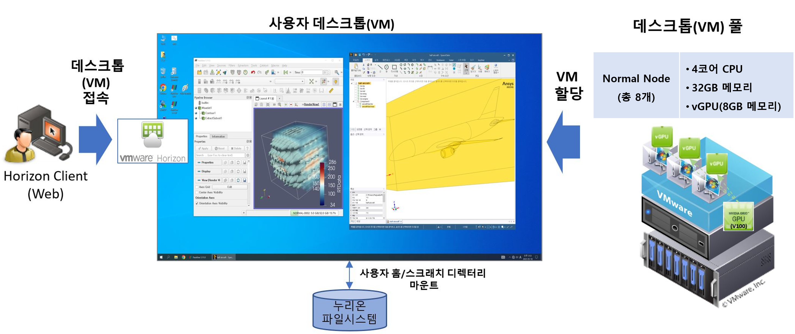
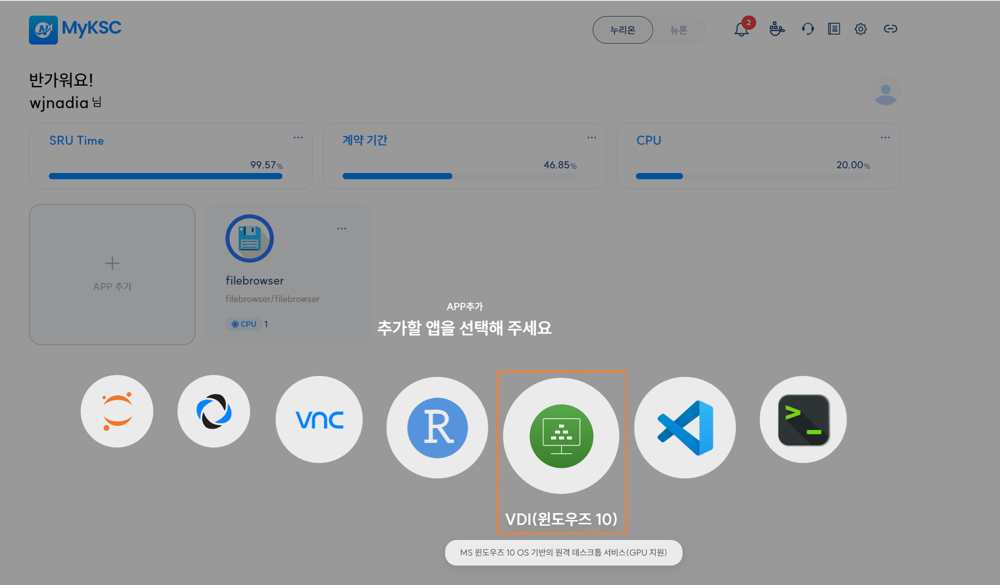
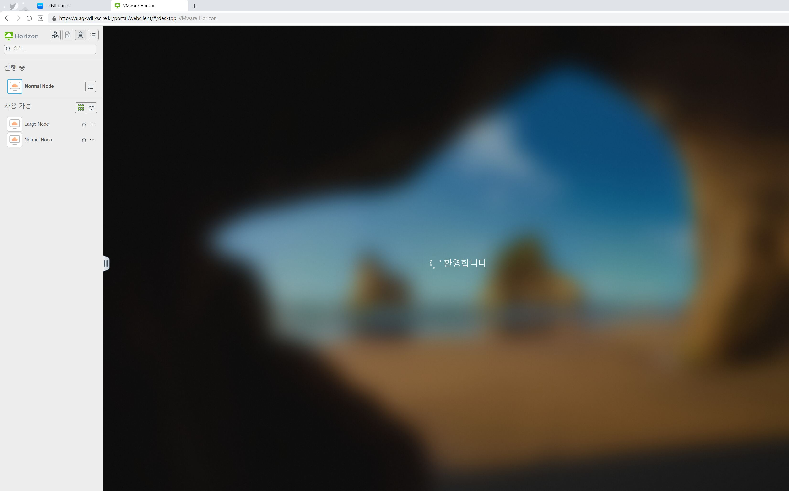
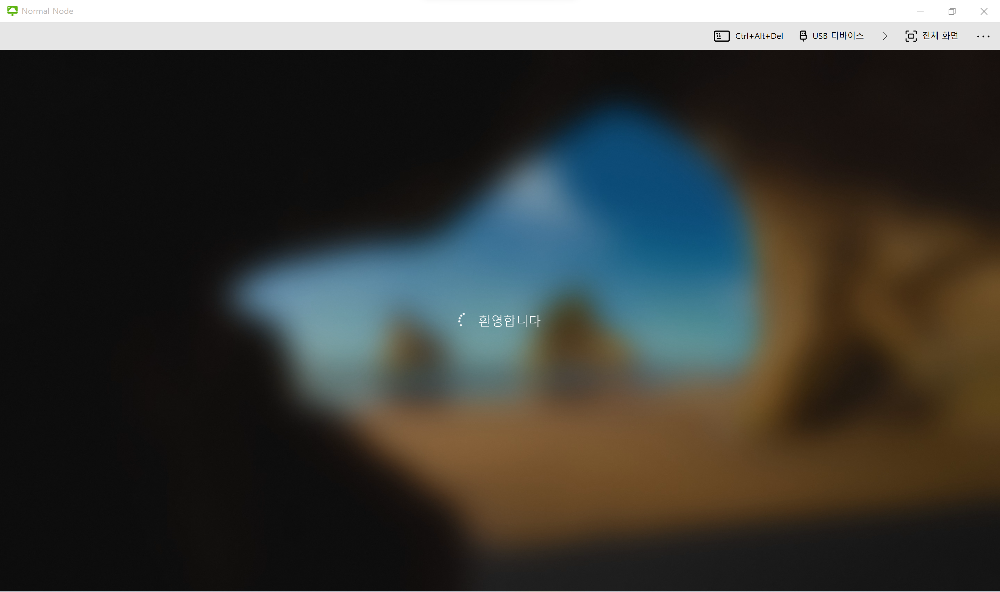
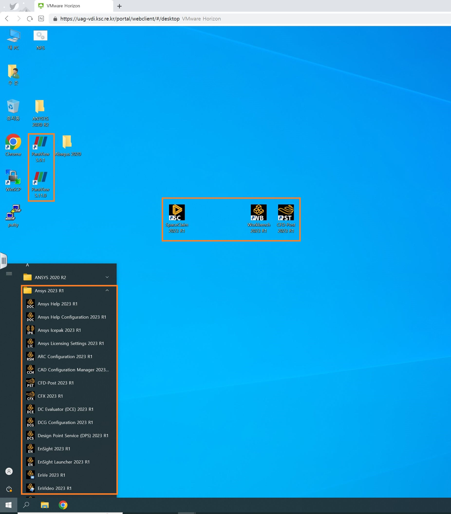
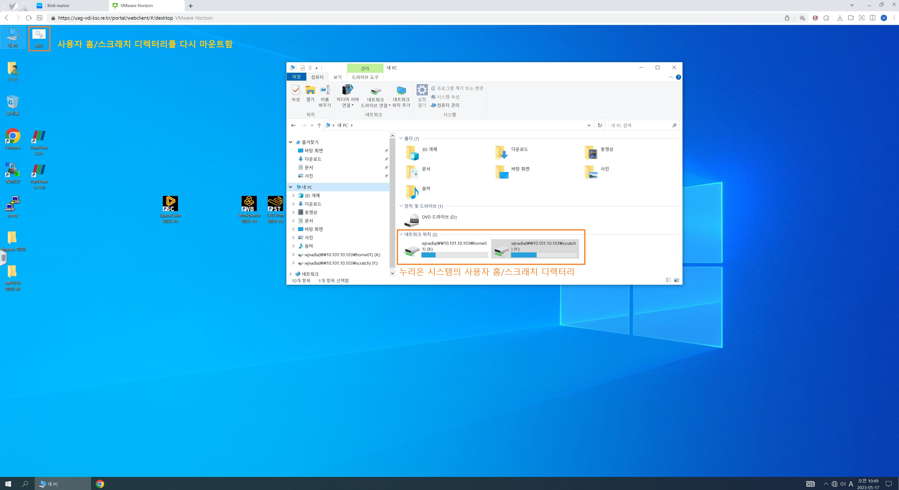
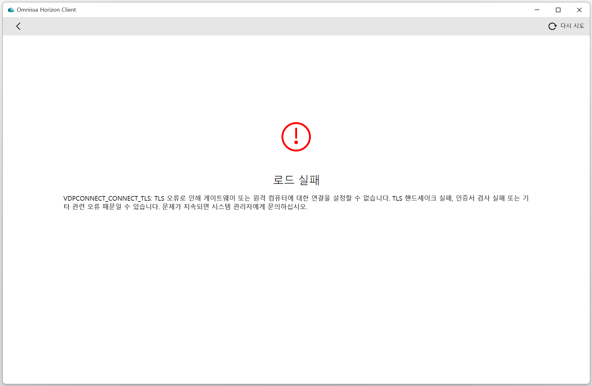

# 데스크톱 가상화(VDI)

## 가. VDI 서비스 개요

데스크톱 가상화(VDI)는 MS Windows 10 환경에서 고성능 그래픽 처리 기능이 필요한 애플리케이션 실행을 위한 원격 데스크톱 서비스다. VDI는 누리온의 파일시스템(사용자홈 및 스크래치  디렉터리)을  마운트 하여  별도  파일 이동 없이 데스크톱(VM)에서 공학해석 전·후처리가 가능하다. 데스크톱(VM)에서 해석(solving)은 지원되지 않으며, 데스크톱(VM) 내에서 터미널 접속 프로그램(putty 등)을 통해 누리온 시스템으로 해석을 수행하면 된다.

데스크톱(VM) 풀은  아래와  같이 Normal Node 를  선택하면  된다.  한정된 데스크톱(VM)으로 다수의 사용자 지원을 위해  데스크톱(VM) 구동  후 idle 상태로 2시간이 경과하면 연결이 해제되고 자동 종료된다.

* Normal Node (총 8개\*)  : 4코어 CPU, 32GB 메모리, 8GB GPU 메모리 할당&#x20;

&#x20;      \* VM 수는 조정될 수 있음

현재 공학해석 전·후처리를  위해  아래와  같은 소프트웨어를  지원하고 있으며, 향후 사용자 요구에 따라 지원 애플리케이션을 확대할 예정이다.

* Ansys (Workbench, SpaceClaim, CFD-Post 등) v2020 R2, v2023 R2
* Abaqus (CAE, Viewer) v2020, v2023
* Paraview  v5.11.1, VAPOR v3.9.0
* Salome-Meca v2023
* VAPOR v3.10.1

<figure><figcaption>
VDI 서비스 구성도
</figcaption></figure>

## 나. VDI 사용 방법

### 1. MyKSC 접속

* 웹 브라우저를 사용하여 MyKSC (KISTI 슈퍼컴퓨터 웹 서비스 포털, [https://portal.my.ksc.re.kr](https://portal.my.ksc.re.kr)) 에 접속한다.
* 슈퍼컴퓨터 사용자 인증을 위해 ID, 패스워드, OTP 번호를 입력하고 Nurion 시스템을 선택하여 로그인 한다.
* 사용자 인증이 성공하면 MyKSC 대시보드에 접속된다.

<figure><figcaption>
MyKSC 로그인 페이지
</figcaption></figure>

### 2. 데스크톱 가상화(VDI) 서버 접속

* MyKSC 대시보드에서   APP 추가(+) 버튼을  클릭하고VDI(윈도우즈클10) 를 선택하면 별도 창에서 VMware Horizon 페이지가 구동 된다.

<figure><figcaption>
대시보드에서  VDI 서비스 시작
</figcaption></figure>

* VDI 서비스는  ‘Horizon Client 프로그램' 또는  ‘웹 브라우저’ 를 통해 사용할 수 있다.

&#x20;     \* 안정성  측면에서 웹  브라우저 보다는 클라이언트 프로그램 사용을 권장한다.

* 처음 사용자는 ‘VMware Horizon Client를 다운로드하려면 [**여기**](https://customerconnect.omnissa.com/downloads/info/slug/desktop_end_user_computing/vmware_horizon_clients/horizon_8)를 클릭’을 선택하여 프로그램을 설치 후 ‘기본 클라이언트 시작’ 을 클릭한다.

<figure><figcaption>
Horizon Client 프로그램을 통한 VDI 서버 접속
</figcaption></figure>

<figure><figcaption>
Horizon Client 프로그램 다운로드
</figcaption></figure>

* &#x20;Horizon Client를 실행하고 나서 설정 > 보안 > 인증서 검사 모드를 '서버 ID 인증서를 확인하지 않음' 으로 설정한다.

<figure><figcaption>
Horizon Client 프로그램에 보안 설정 확인
</figcaption></figure>

* Horizon Client의 ‘서버 추가'를 클릭하여 '연결 서버의 이름'으로 'https://uag-vdi.ksc.re.kr’ 을  입력 후 연결한다.

<figure><figcaption>
Horizon Client 프로그램에서 VDI 서버 추가
</figcaption></figure>

### 3. 사용자 데스크톱 연결 로그인

Horizon  Client 프로그램에서 Normal Node 데스크톱 풀을 선택하여 VM 기반의 사용자 데스크톱에 연결한다. 가용 VM이 모든 사용중인 경우 VM이 할당되지 않을 수 있다.

* Normal Node (총 8개\*)  : 4코어 CPU, 32GB 메모리, 8GB GPU 메모리 할당&#x20;

&#x20;     \* VM 수는 조정될 수 있음

<figure><figcaption>
Horizon Client 프로그램을 통한 VDI 서버 접속화면
</figcaption></figure>

* 데스크톱(VM)이 할당되면 윈도우즈 10 OS에 연결 로그인 되며  약 30초 이내 소요된다.

<figure><figcaption>
웹 브라우저를 통한 사용자 데스크톱(VM) 연결 로그인 화면
</figcaption></figure>

<figure><figcaption>
VMware Horizon Client 프로그램을 통한 사용자 데스크톱(VM) 연결 로그인 화면
</figcaption></figure>

* 바탕화면 혹은 시작-프로그램 목록에서 설치된 소프트웨어 목록을 확인할 수 있다.
  * Ansys (Workbench, SpaceClaim, CFD-Post 등) v2020 R2, v2023 R2
  * Abaqus (CAE, Viewer) v2020, v2023
  * Paraview v5.11.1
  * Salome-Meca v2023
  * VAPOR 3.10.1

<figure><figcaption>
사용자 데스크 톱(VM) 설치 소프트웨어 목록
</figcaption></figure>

* 사용자 데스크톱의 로그인 과정에서 누리온 시스템의 home01과 scratch의 사용자 디렉터리가 자동으로 마운트 되며, 마운트가 되지 않거나 오류가 있을 경우 바탕화면의 'NFS' 아이콘을 실행한다.
* 보안을 위해 C:\ 드라이브, 제어판 등은 접근이 차단되어 있으며, 사용자가 생성 및 저장한 파일들은 VM 종료 시 모두 초기화 된다.  따라서, 계속 보관이 필요한 파일들은 누리온 시스템의 사용자 홈 및 스크래치 디렉터리에 저장해야 한다.
* 데스크톱(VM) 구동  후 idle 상태로 2시간이 경과하면 연결이 해제되고 자동 종료된다.

<figure><figcaption>
사용자 데스크 톱(VM)에서 누리온 시스템 사용자 홈/스크래치 디렉터리
</figcaption></figure>

* 웹 브라우저를 통해 접속된 데스크톱에서는 왼쪽 메뉴 패널의 ‘파일 전송 패널 열기’를 실행하여 사용자 PC의 파일을 업로드 할 수 있다.

<figure><figcaption>
웹  브라우저를  통해 연결된 사용자 데스크 톱(VM)에서 PC의 파일 업로드 하기
</figcaption></figure>


**(TLS 오류 발생 시 조치 방법)** &#x20;

데스크톱 풀을 선택하여 사용자 VM을 구동하는 과정에서 TLS 인증 오류가 발생하는 경우,  **사용자 PC에  설치된 Horizon Client를 직접 실행**하고 나서 설정 > 보안 > 인증서 검사 모드를 '서버 ID 인증서를 확인하지 않음' 으로 설정한다. 이어서 MyKSC 대시보드에서 VDI 서비스를 다시 시작한다.&#x20;


<figure><figcaption>
TLS 인증 오류 화면
</figcaption></figure>

<figure><figcaption>
보안 인증서 검사 모드 설정 화면
</figcaption></figure>


2023년 2월 20일에 마지막으로 업데이트되었습니다.

