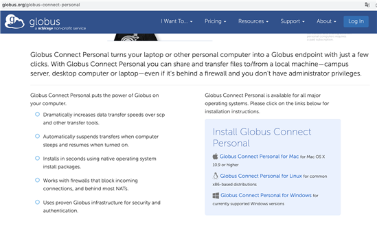
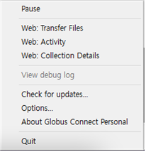
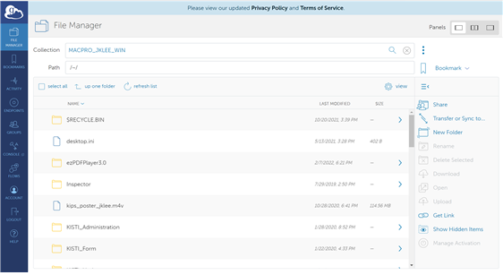
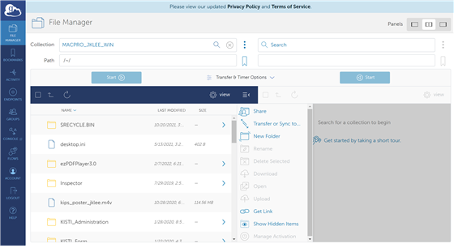
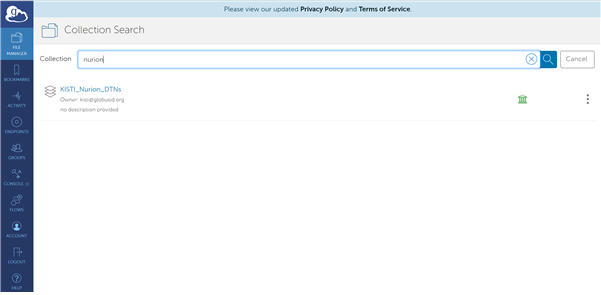

# DTN(데이터전송노드)

### 가. **시스템 환경 및 사용 신청** 

대용량 데이터를 활용한 초고성능컴퓨터의 사용이 증가하고 있는 환경에서 누리온에서는 대용량 데이터의 효율적인 전송을 위하여 Science DMZ 기반의 데이터 전송 전용 노드(DTN)을 구축하여 운영합니다. 누리온 DTN을 사용하기 위해서는 먼저 Globus(https://globus.org) Web App에 로그인 가능하여야 합니다. 이때 KAFE(https://www.kafe.or.kr)에 회원으로 가입되어 있다면 별도의 회원가입 없이 KAFE 계정을 활용하여 접속할 수 있습니다.

### **나. 사용자 정책 및 신청 방법** 

DTN 사용은 대표홈페이지(https://www.ksc.re.kr)의 "기술지원 -> 상담" 메뉴 하단의 "상담신청"(상담 카테고리: DTN, 상담분류 DTN 계정발급)을 이용하여 신청한 후 사용이 가능하며 /scratch 디렉터리에 직접 접근할 수 있습니다. 따라서 모든 사용 정책은 누리온의 /scratch 정책을 따라 갑니다. (15일 이상 접근하지 않은 파일은 삭제).

※ 중요 데이터는 사용자 로컬 시스템에 반드시 보관 권장합니다. 일반적인 기술 지원 관련 문의는 consult@ksc.re.kr 메일이나 센터 홈페이지(https://www.ksc.re.kr) 상담게시판을 이용 바랍니다.

### **다. 사용 방법** 

#### **1. Globus Web App 접속** 

Globus Web App을 보다 간편하게 접속하기 위하여 먼저 Globus Connect Personal(https://www.globus.org/globus-connect-personal)을 다운로드 받아 설치 바랍니다. 해당 사이트에 접속하여 운영체제에 맞는 프로그램을 다운받아 설치하면 됩니다. 설치 관련하여서는 본 지침서에서 제공하지 않습니다. 해당 사이트를 참조하셔서 설치 바랍니다.

<figure><figcaption>
그림 1 Globus Connect Personal 설치 안내 페이지
</figcaption></figure>

※ Globus Connect Personal 설치 및 설정 참조 :\
https://docs.globus.org/how-to/globus-connect-personal-windows/

※ 로그인 방법 참조 : https://docs.globus.org/how-to/get-started/

### **2. Globus Connect Personal 실행**

* 프로그램을 설치하고 Globus Connect Personal을 실행하면 윈도우즈의 작업 표시줄에 그림과 같이 아이콘이 나타나게 됩니다.

<figure><figcaption>
그림 2 작업표시줄의 Globus Connect Personal 아이콘
</figcaption></figure>

* 아이콘에서 마우스 오른쪽 클릭을 하면 간단한 메뉴를 볼 수 있습니다.

<figure><figcaption>
그림 3  Globus Connect Personal 간단 메뉴
</figcaption></figure>

* 이 메뉴에서 “Web: Transfer Files”를 클릭하면 브라우저를 이용해서 파일을 송수신할 수 있습니다.

<figure><figcaption>
그림 4 Web: Transfer Files 실행화면(기본보기)
</figcaption></figure>

* 브라우저에 보이는 패널의 모양은 “Web: Transfer Files” 실행 화면의 우측 상단에서 변경할 수 있습니다.

<figure><figcaption>
그림 5 Web: Transfer Files 실행화면 패널 보기 변경
</figcaption></figure>

### **3. 누리온 DTN 검색 및 접속**

* “Web: Transfer Files”실행화면의 검색창에 “nurion”이라는 키워드를 입력하고 검색을 하면 “KISTI\_Nurion\_DTNs”가 검색됩니다.

<figure><figcaption>
그림 6  KISTI_Nurion_DTN 검색(검색키워드: nurion)
</figcaption></figure>

* 검색된 결과를 클릭하면 누리온의 /scratch 디렉터리에 접속 됩니다.

<figure><figcaption>
그림 7 KISTI_Nurion_DTN 접속
</figcaption></figure>

### **4. 파일 전송**

* Globus Web App에서는 개인 PC에 전송하려는 데이터를 선택한 후 상단에 있는 “Start”버튼을 클릭하면 파일이 전송됩니다. 그리고, Globus에 가입된 해외 센터의 데이터를 누리온으로 직접 전송할 수도 있습니다.&#x20;
* 예를 들어 NERSC에서 제공하는 “Climate segmentation benchmark data”나 “CosmoFlow benchmark data”도 누리온으로 바로 전송 가능합니다. 누리온 DTN을 검색했던 것과 같은 방법으로 검색창에 키워드(ex) climate, cosmoflow, etc.)를 입력하고 검색 한 후 전송을 원하는 데이터를 찾아서 전송(상단에 있는 “Start” 버튼 클릭 or 마우스 드래그 앤 드롭) 하면 바로 고속으로 누리온에 전송됩니다.

<figure><figcaption>
그림 8 CosmoFlow benchmark data(from NERSC to Nurion) 전송 예제
</figcaption></figure>

* 파일 전송을 시작하면 창의 오른쪽 상단에 전송 요청이 성공 되었다고 메시지(Transfer request submitted successfully)가 나타납니다.

<figure><figcaption>
그림 9 데이터 전송 요청 성공 메시지 출력 화면
</figcaption></figure>

* 파일이 전송되는 진행 상황은 왼쪽에 있는 “ACTIVITY” 탭에서 확인할 수 있습니다.

<figure><figcaption>
그림 10 데이터 전송 진행 현황 보기
</figcaption></figure>

* “ACTIVITY” 탭에서 현재 진행 중인 데이터 전송 요청을 클릭하면 보다 상세한 진행 상황을 확인할 수 있습니다.

<figure><figcaption>
그림 11 데이터 전송 진행 현황 상세 보기
</figcaption></figure>

* 창이 닫히더라도 데이터 전송은 정상적으로 진행이 되며 전송이 완료되면 메일로도 확인 가능합니다.
