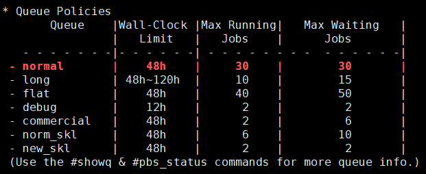

# 스케줄러(PBS)를 통한 작업 실행

5호기 누리온 시스템의 작업 스케줄러는 Portable Batch System (이하 PBS)을 사용합니다. 이 장에서는 스케줄러를 통해 작업 제출하는 방법 및 관련 명령어들을 소개합니다. 사용자가 작업 제출 시 사용할 수 있는 큐는 정해져 있으며, 큐 별로 사용자별 최대 제출할수 있는 작업의 수는 제한이 있고, 이 값은 시스템의 부하 정도에 따라 변동될 수 있습니다.

누리온 시스템은 **배타적 노드 할당 정책**을 기본적으로 적용하여, 한 노드에 한 사용자의 작업만이 실행될 수 있도록 보장합니다. 이는 공유 노드 정책을 적용할 경우 종종 발생할 수 있는 사용자 어플리케이션의 심각한 성능 저하를 예방하기 위함입니다. 그러나 상용 SW를 사용할 수 있는 큐의 경우는 노드의 규모가 크지 않아서 효율적인 자원 활용을 위해 공유 노드 정책을 적용합니다.

사용자 작업은 로그인 노드를 통해서만 제출이 가능하며 일반 사용자는 계산노드에 직접적으로 접근할 수 없습니다.

또한, <mark style="color:blue;">**사용자 작업은 /scratch/$USER 에서만 제출이 가능합니다**</mark>.


## 가. 큐 구성

* Commercial 큐 (상용SW 수행을 위한 큐)와 디버깅을 위한 debug큐는 공유 노드 정책이 적용되어 가용 자원(CPU core) 범위 내에서 노드 당 여러 개의 작업이 배치되며, 나머지 큐에서는 배타적 노드 정책으로 노드 당 하나의 작업만이 배치됩니다.
* 작업 큐
  * 일반사용자가 사용할 수 있는 큐와 사용자별 제출 가능 작업 개수는 다음 표와 같습니다. (2021년 4월 기준)

**※ 노드 구성은 시스템 부하에 따라 시스템 운영 중에 조정될 수 있습니다.** (showq 명령어와 motd를 통해 노드 구성과 최대 작업가능개수를 수시로 확인할 수 있음)

<figure><figcaption></figcaption></figure>

**※ 노드 구성은 시스템 부하에 따라 시스템 운영 중에 조정될 수 있음.** (showq 명령어와 motd를 통해 노드 구성과 최대 작업가능개수를 수시로 확인할 수 있음)


### 1. 큐별 설명

<table><thead><tr><th width="105" align="center">구분</th><th width="125" align="center">큐명</th><th align="center">특징</th></tr></thead><tbody><tr><td align="center">KNL</td><td align="center">exclusive</td><td align="center">R&#x26;D 혁신지원 프로그램 중 거대 도전연구 및 집단연구 분야 지원을 위한 전용자원 큐</td></tr><tr><td align="center">KNL</td><td align="center">normal</td><td align="center">무상 서비스 사용자(창의연구 분야, 국가전략 분야, 혁신지원 분야)와 유상 서비스 사용자를 위한 일반자원 큐</td></tr><tr><td align="center">KNL</td><td align="center">long</td><td align="center">장기간 작업 수행을 할 수 있는 큐로 최대 120시간(5일) 동안 사용할 수 있는 일반자원 큐</td></tr><tr><td align="center">KNL</td><td align="center">flat</td><td align="center">메모리 모드가 flat으로, MCDRAM(16GB)과 DDR4를 지정하여 사용할 수 있으며 최대 102GB까지 메모리 사용이 가능한 일반자원 큐<br></td></tr><tr><td align="center">KNL</td><td align="center">debug</td><td align="center">KNL 노드의 디버깅을 위한 큐로 공유노드 정책이 적용되어 있는 일반자원 큐, 인터렉티브 작업을 통해 디버깅 가능</td></tr><tr><td align="center">SKL</td><td align="center">commercial</td><td align="center">상용 어플리케이션 수행을 위한 일반자원 큐로 공유노드 정책 적용(*Gaussian을 제외한 상용 SW는 commercial 큐 사용을 원칙으로 함)</td></tr><tr><td align="center">SKL</td><td align="center">norm_skl</td><td align="center">SKL 노드의 일반자원 큐</td></tr><tr><td align="center">SKL</td><td align="center">new_skl</td><td align="center">SKL 노드의 일반자원 큐</td></tr></tbody></table>

### 2. 작업 제출 개수 제한

* 사용자별 최대 제출 작업 개수 : 초과하여 작업을 제출한 경우 제출 시점에 오류가 발생합니다.
* 사용자별 최대 실행 작업 개수 : 초과하여 작업을 제출한 경우 이전 작업이 끝날 때까지 기다려야 합니다.

### 3. 리소스 점유 제한

* 작업별 노드 점유 개수 (최대|최소) : 단일 작업에서 점유 노드 수가 최소\~최대 범위를 벗어나는 경우 제출 시점에 오류가 발생합니다. 사용자의 대기 및 실행 중인 작업의 점유 노드 개수와는 무관합니다.

### 4. KNL 메모리 모드에 따른 큐 구분(Cluster 모드는 전부 Quadrant)

* exclusive, normal, long, debug 큐는 Cache 모드(MCDRAM을 L3캐시로 사용), flat큐는 Flat 모드(MCDRAM을 DDR4와 같이 RAM으로 사용)로 설정되어 있습니다.
* 시스템 보호를 위해 Cache 모드는 최대 가용 메모리 82GB, Flat 모드는 102GB 제한

### 5. Hyperthread off 설정으로 KNL 사용시 노드 당 최대 68 스레드, SKL 사용시 노드 당 최대 40 스레드 사용 가능


## 나. 작업 제출 및 모니터링

### 1. 배치 작업 제출

* 작업 스크립트 작성 및 예시
  * 작업 스크립트 작성 시 아래 필수 키워드, 아래 <mark style="color:red;">작업 스크립트 예시</mark>와 별첨1 <mark style="color:red;">작업 스크립트 주요 키워드</mark>를 참고하여 작성 후 제출합니다. 또한. 작업 스크립트 예시 파일은 <mark style="color:red;">/apps/shell/home/job\_examples</mark>에서 확인할 수 있습니다.
* PBS 작업 스케줄러 필수 옵션


| 필수 옵션   | 설명                |
| ------- | ----------------- |
| #PBS –V | 현재 환경변수 유지        |
| #PBS –N | 작업 이름 설정          |
| #PBS –q | 작업을 실행할 큐         |
| #PBS –l | 작업에 사용할 리소스 설정    |
| #PBS –A | 사용 프로그램 정보(통계 목적) |


*   자원 할당 변수 키워드

    사용하고자 하는 자원을 select, ncpus, ompthreads, miprocs, walltime 등의 키워드로 지정

| 키워드        | 설명                                                 |
| ---------- | -------------------------------------------------- |
| select     | 사용할 노드 수                                           |
| ncpus      | <p>사용할 CPU 코어 수</p><p>(≥ 한 노드당 프로세스 수 * 스레드 수)</p> |
| mpiprocs   | 사용할 한 노드당 프로세스 수                                   |
| ompthreads | 사용할 OMP 스레드 수                                      |
| walltime   | 작업 실행 시간                                           |

<mark style="color:red;">※ 누리온 사용자 편익 증대를 위한 자료 수집의 목적으로, 아래와 같이 PBS 옵션을 통한 사용 프로그램 정보 작성을 의무화 합니다. 즉, 사용하는 어플리케이션에 맞게 PBS의 -A 옵션을 아래 표를 참조하여 반드시 기입한 후 작업을 제출해야 합니다. (2019년 4월부터 적용)</mark>

<mark style="color:red;">※ 어플리케이션 구분을 추가는 주기적으로 수집된 사용자 요구에 맞추어 진행됩니다. 추가를 원하시면</mark> consult@ksc.re.kr로 <mark style="color:red;">해당 어플리케이션에 대한 추가 요청을 해주시기 바랍니다.</mark>

**\[Application별 PBS 옵션 이름표]**

| **Application종류**   | **PBS 옵션 이름**                   | **Application종류** | **PBS 옵션 이름** |
| ------------------- | ------------------------------- | ----------------- | ------------- |
| ANSYS (CFX, Fluent) | **ansys**                       | VASP              | **vasp**      |
| Abaqus              | **abaqus**                      | Gromacs           | **gromacs**   |
| Nastran(MSC One)    | **nastran**                     | Amber             | **amber**     |
| Gaussian            | **gaussian**                    | LAMMPS            | **lammps**    |
| OpenFoam            | **openfoam**                    | NAMD              | **namd**      |
| WRF                 | **wrf**                         | Quantum Espresso  | **qe**        |
| CESM (CAM 포함)       | **cesm**                        | QMCpack           | **qmc**       |
| MPAS                | **mpas**                        | BWA               | **bwa**       |
| ROMs                | **roms**                        | SIESTA            | **siesta**    |
| MOM                 | **mom**                         | in-house code     | **inhouse**   |
| TensorFlow          | **tf**                          | Caffe             | **caffe**     |
| PyTorch             | **pytorch**                     | Qchem             | **qchem**     |
| grims               | **grims**                       | RAMSES            | **ramses**    |
| cp2k                | **cp2k**                        | Charmm            | **charmm**    |
| 그 외 applications    | <p><strong>etc</strong><br></p> |                   |               |

※ 예: VASP 사용자의 경우 PBS 프로그램 작업 스크립트에 #PBS -A vasp을 추가 작성

* 환경변수

| 환경변수            | 설명                                |
| --------------- | --------------------------------- |
| PBS\_JOBID      | Job에 할당되는 식별자                     |
| PBS\_JOBNAME    | 사용자에 의해 제공되는 Job 이름               |
| PBS\_NODEFILE   | 작업에 할당된 계산노드들의 리스트를 포함하고 있는 파일 이름 |
| PBS\_O\_PATH    | 제출 환경의 경로 값                       |
| PBS\_O\_WORKDIR | qsub이 실행된 절대경로 위치                 |
| TMPDIR          | Job을 위해 지정된 임시 디렉터리               |

PBS에서 배치 작업을 수행하기 위해서는 위에서 설명된 PBS 키워드들을 사용하여 작업 스크립트 파일을 작성해야 합니다.

※ /apps/shell/home/job\_examples 에서 작업제출 스크립트 예제 파일을 복사하여 사용 가능

* Serial 프로그램 작업 스크립트 작성 예제(serial.sh)

```bash
#!/bin/sh
#PBS -N serial_job
#PBS -V
#PBS -q normal
#PBS -A {PBS 옵션 이름} # Application별 PBS 옵션 이름표 참고
#PBS -l select=1:ncpus=1:mpiprocs=1:ompthreads=1
#PBS -l walltime=04:00:00
#PBS -m abe # 작업 이메일 알림 옵션
#PBS -M abc@def.com # 수신할 메일 주소

cd $PBS_O_WORKDIR

module purge
module load craype-mic-knl

./test.exe
```

※ 1노드 점유 순차, 사용 예제

※ 위 예제와 같이 #PBS –m, #PBS –M 옵션을 사용하여 작업을 제출하는 경우 작업이 실행될 때와 완료 시, 그리고 작업이 중단되는 경우에도 abc@def.com로 이메일 발송


* OpenMP 프로그램 작업 스크립트 작성 예제(openmp.sh)

```bash
#!/bin/sh
#PBS -N openmp_job
#PBS -V
#PBS -q normal
#PBS -A {PBS 옵션 이름} # Application별 PBS 옵션 이름표 참고
#PBS -l select=1:ncpus=64:mpiprocs=1:ompthreads=64
#PBS -l walltime=04:00:00

cd $PBS_O_WORKDIR

module purge module load craype-mic-knl

./test_omp.exe
```

※ 1노드 점유, 노드 당 64 스레드(총 64 OpenMP 스레드) 사용 예제


* MPI (IntelMPI)프로그램 작업 스크립트 작성 예제(mpi.sh)

```bash
#!/bin/sh
#PBS -N IntelMPI_job
#PBS -V
#PBS -q normal#PBS -A {PBS 옵션 이름} # Application별 PBS 옵션 이름표 참고
#PBS -l select=4:ncpus=64:mpiprocs=64
#PBS -l walltime=04:00:00

cd $PBS_O_WORKDIR

module purge
module load craype-mic-knl intel/18.0.3 impi/18.0.3

mpirun ./test_mpi.exe
```

※ 4노드 점유, 노드 당 64 프로세스(총 256 MPI 프로세스) 사용 예제


* MPI (OpenMPI)프로그램 작업 스크립트 작성 예제(mpi.sh)

```bash
#!/bin/sh
#PBS -N OpenMPI_job
#PBS -V
#PBS -q normal
#PBS -A {PBS 옵션 이름} # Application별 PBS 옵션 이름표 참고
#PBS -l select=4:ncpus=64:mpiprocs=64
#PBS -l walltime=04:00:00

cd $PBS_O_WORKDIR

module purge
module load craype-mic-knl gcc/7.2.0 openmpi/3.1.0

mpirun ./test_mpi.exe
```

※ 4노드 점유, 노드 당 64 프로세스(총 256 MPI 프로세스) 사용 예제


* MPI (Mvapich2) 프로그램 작업 스크립트 작성 예제(mpi\_mvapich2.sh)

```bash
#!/bin/sh
#PBS -N mvapich2_job
#PBS -V
#PBS -q normal
#PBS -A {PBS 옵션 이름} # Application별 PBS 옵션 이름표 참고
#PBS -l select=4:ncpus=64:mpiprocs=64:ompthreads=1
#PBS -l walltime=04:00:00

cd $PBS_O_WORKDIR

module purge
module load craype-mic-knl intel/18.0.3 mvapich2/2.3.1

TOTAL_CPUS=$(wc -l $PBS_NODEFILE | awk '{print $1}')

mpirun_rsh -np ${TOTAL_CPUS} -hostfile $PBS_NODEFILE ./test_mpi.exe
```

※ 4노드 점유, 노드 당 64 프로세스(총 256 MPI 프로세스) 사용 예제

<mark style="color:red;">※ mpirun 으로도 적은 규모의 노드에서는 실행이 가능하나, 많은 노드를 사용하는 작업의 경우</mark>\ <mark style="color:red;">작업 전개가 정상적으로 진행되지 않을 수 있으니 위 예시와 같이 mpirun\_rsh 으로 실행 권장</mark>


* Hybrid(IntelMPI + OpenMP) 프로그램 작업 스크립트 작성 예제(hybrid\_intel.sh)

```bash
#!/bin/sh
#PBS -N hybrid_job
#PBS -V
#PBS -q normal
#PBS -A {PBS 옵션 이름} # Application별 PBS 옵션 이름표 참고
#PBS -l select=4:ncpus=64:mpiprocs=2:ompthreads=32
#PBS -l walltime=04:00:00

cd $PBS_O_WORKDIR

module purge
module load craype-mic-knl intel/18.0.3 impi/18.0.3

mpirun ./test_mpi.exe
```

※ 4노드 점유, 노드 당 2 프로세스, 프로세스 당 32 스레드(총 8 MPI 프로세스, 256 OpenMP 스레드) 사용 예제


* Hybrid(openMPI + OpenMP) 프로그램 작업 스크립트 작성 예제(hybrid\_openmpi.sh)

```bash
#!/bin/sh
#PBS -N hybrid_job
#PBS -V
#PBS -q normal
#PBS -A {PBS 옵션 이름} # Application별 PBS 옵션 이름표 참고
#PBS -l select=4:ncpus=64:mpiprocs=2:ompthreads=32
#PBS -l walltime=04:00:00

cd $PBS_O_WORKDIR

module purge
module load craype-mic-knl gcc/7.2.0 openmpi/3.1.0

mpirun --map-by NUMA:PE=34 ./test_mpi.exe
```

※ 4노드 점유, 노드 당 2 프로세스, 프로세스 당 32 스레드(총 8 MPI 프로세스, 256 OpenMP 스레드) 사용 예제


* Hybrid(Mvapich2 + OpenMP) 프로그램 작업 스크립트 작성 예제(hybrid\_mvapich2.sh)

```bash
#!/bin/sh
#PBS -N hybrid_job  
#PBS -V
#PBS -q normal
#PBS -A {PBS 옵션 이름} # Application별 PBS 옵션 이름표 참고
#PBS -l select=4:ncpus=64:mpiprocs=2:ompthreads=32
#PBS -l walltime=04:00:00

cd $PBS_O_WORKDIR

module purge
module load craype-mic-knl intel/18.0.3 mvapich2/2.3.1

TOTAL_CPUS=$(wc -l $PBS_NODEFILE | awk '{print $1}')

mpirun_rsh -np ${TOTAL_CPUS} -hostfile $PBS_NODEFILE OMP_NUM_THREADS=$OMP_NUM_THREADS ./test_mpi.exe
```

※ 4노드 점유, 노드 당 2 프로세스, 프로세스 당 32 스레드(총 8 MPI 프로세스, 256 OpenMP 스레드) 사용 예제

<mark style="color:red;">※ mpirun 으로도 적은 규모의 노드에서는 실행이 가능하나, 많은 노드를 사용하는 작업의 경우</mark>\ <mark style="color:red;">작업 전개가 정상적으로 진행되지 않을 수 있으니 위 예시와 같이 mpirun\_rsh 으로 실행 권장</mark>


* 작성한 작업 스크립트 제출 예시

```shell-session
$ qsub mpi.sh
```

※ mpi.sh 파일은 예시로, 작성한 작업 스크립트 파일을 이용하여 작업을 제출

* PBS 배치 작업을 수행하는 경우, 작업 중 STDOUT(표준 출력)과 STDERR(표준 에러)를 시스템 디렉터리의 output에 저장하였다가 작업 완료 후 사용자 작업 제출 디렉터리로 복사한다. 기본적으로, 작업 완료 시까지 작업 관련 내용을 확인할 수 없으나 다음 키워드를 추가하면 확인 가능합니다.
* PBS에 의해 생성되는 STDOUT / STDERR를 작업 실행 중 확인할 수 있는 키워드(/home01에 파일 생성)

```bash
#PBS -W sandbox=PRIVATE
```

* 리눅스의 Redirection 기능을 사용하여 작업 실행 확인

```bash
./test.exe 1>stdout 2>stderr
```

* 작업 이메일 알림 지정

```shell-session
$ qsub -m -M 
  ex) qsub -m abe -M abc@def.com hello_world.sh
```

| 옵션 | 설명            |
| -- | ------------- |
| a  | job 중단 시(기본값) |
| b  | job 시작 시      |
| e  | job 실행 완료 시   |
| n  | 이메일 알림을 받지 않음 |


### 2. 인터렉티브 작업 제출

인터렉티브 작업 제출의 경우 잡 스크립트 작성과는 달리 #PBS를 생략하고 –I –A 등의 옵션만 사용

<mark style="color:red;">※ 2시간 이상 미사용시 타임아웃으로 작업이 종료되고 자원이 회수됨, 인터렉티브 작업의 walltime은 최대 12시간으로 고정됨</mark>

* 배치 스크립트 대신 "-I" 옵션 사용

```shell-session
$ qsub -I -l select=1:ncpus=68:ompthreads=1 -l walltime=12:00:00 -q normal -A {PBS 옵션 이름}
```

* 인터렉티브 작업 제출 시 그래픽 환경 사용 (-X)

```shell-session
$ qsub -I -X -l select=1:ncpus=68:ompthreads=1 -l walltime=12:00:00 -q normal -A {PBS 옵션 이름}
```

※ 여기서 -l select 이하 구문의 내용은 사용자 수요에 따라 변경하여 사용하면 되나, 위 구문들(리소스 점유, 큐 이름, PBS 옵션 이름)은 반드시 작성하고 작업을 제출해야함

* 인터렉티브 작업 제출 시 기존 환경변수 상속 (-V)

```shell-session
$ qsub -I -V -l select=1:ncpus=68:ompthreads=1 -l walltime=12:00:00 -q normal -A {PBS 옵션 이름}
```

※  위 예제에서 소문자 l과 대문자 I를 유념하여 참조

####

### 3. 작업 모니터링

작업 모니터링 관련 명령어들은 로그인 노드에서만 사용 가능합니다.

* 큐 조회

```shell-session
$ showq
```

* 큐별 노드 유휴 자원 조회

```shell-session
$ pbs_status
```

* 현재 사용 계정으로 사용 가능한 큐리스트 조회

```shell-session
$ pbs_queue_check
```

* 곧 실행될 작업(top job) 조회

```
$ show_topjob 
```

* 작업 상태 조회

| 옵션       | 설명                |
| -------- | ----------------- |
| qstat -u | 자신의 작업만 조회        |
| qstat -i | Q 및 H 상태의 작업만을 조회 |
| qstat -f | 작업 상세 조회          |
| qstat -x | 종료된 작업 조회         |


```shell-session
$ qstat <-a, -n, -s, -H, -x, ...>

  ex> qstat
Job id       Name      User      Time Use S Queue
----------------------------------------------------
0001.pbs    test_01   user01    8245:43: R normal
0002.pbs    test_02   user02    8245:44: R flat
0003.pbs    test_03   user03    7078:45 R norm_skl
0003.pbs    test_04   user04    1983:11: Q long
```

※ Job Id: 작업번호.pbs

※ Name: 작업 스크립트의 #PBS –N 값

※ S: 작업의 동작 상태를 표시(R-수행 중/ Q-대기/ H-일시정지/ E-오류)


* 작업 속성 조회

```shell-session
$ qstat -f 

  ex> qstat -f 0000
Job Id : 0000.pbs
    Job_Name = test
    Job_Owner = user@login01
    resources_used.cpupercent = 6416
    resources_used.cput = 8245:43:20
    resources_used.mem = 33154824kb
    resources_used.ncpus = 64
    resources_used.vmem = 999899940kb
    resources_used.walltime = 128:54:21
    job_state = R
<생략>
```


## 다. 작업 제어

* 작업 삭제

```shell-session
$ qdel 
```

* 작업 suspend/resume

```shell-session
$ qsig -s  
```


2022년 11월 8일에 마지막으로 업데이트 되었습니다.


