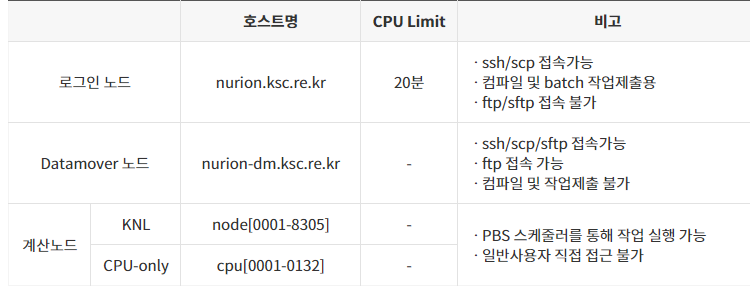
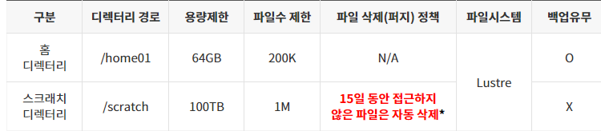

# 사용자 환경

## 가. 계정발급

### 1. 누리온 시스템의 사용을 승인받은 연구자는 KISTI 국가슈퍼컴퓨팅센터 홈페이지(https://www.ksc.re.kr) 웹 서비스를 통해 계정을 신청합니다.

#### 1) 신청 방법 : KISTI 홈페이지 웹사이트접속, (상단) 사용신청 -> (상단) 신청 -> 신청서선택

* 무료계정 : 누리온 시스템 혁신지원 프로그램, 5호기 초보사용자
* 유료계정 : 5호기 일반사용자, 5호기 학생사용자
* 계정 발급 완료 시 신청서에 기입한 이메일로 계정 관련 정보 발송

#### 2) OTP (One Time Password, 일회용 비밀번호) 인증코드 발급

수신하신 계정 정보 이메일을 참고하여 아래와 같이 작성하여 account@ksc.re.kr을 통해 인증코드를 발급받습니다.

| 메일 제목    | <p>OTP 인증코드 발송 요청 - 사용자 ID</p><p>(예) OTP 인증코드 발송 요청 - x123abc</p>                             |
| -------- | --------------------------------------------------------------------------------------------- |
| 수신인      | account@ksc.re.kr                                                                             |
| 메일내용(예제) | <p>로그인 ID: x123abc</p><p>휴대폰번호: 010-1234-5678</p><p>이름: 홍길동</p><p>통신사: LG 유플러스(or SKT/KT)</p> |

#### 3) OTP 앱 설치

* 슈퍼컴퓨팅 보안 접속을 위해 OTP 스마트폰 앱이 제공됩니다.
* OTP 스마트폰 앱은 안드로이드 앱 스토어(Google Play)나 아이폰 앱 스토어(App Store)에서 “Any OTP”로 검색 후 미래기술(mirae-tech)에서 개발한 앱을 설치하여 사용할 수 있습니다.
* 슈퍼컴퓨터 로그인 시 “Any OTP” 앱의 OTP 보안숫자를 반드시 입력해야 합니다.
  * 스마트폰을 사용하고 있지 않은 사용자의 경우, 계정담당자(account@ksc.re.kr)에게 문의
  * 자세한 OTP 설치 및 이용방법은 KISTI 홈페이지 > 기술지원 > 지침서에서 “OTP 사용자 매뉴얼” 참조
  * LG 유플러스의 경우에는 문자가 스팸 처리되므로 이메일로 알려드립니다.


## 나. 로그인

* 사용자는 누리온 시스템 로그인 노드(nurion.ksc.re.kr)를 통해서 접근이 가능합니다. (하단, 노드 구성 참조).
  * 웹 브라우저를 통해 MyKSC(KISTI 슈퍼컴퓨터 웹 서비스 포털, [https://portal.my.ksc.re.kr](https://portal.my.ksc.re.kr))에 로그인하여 GUI 기반의 HPC 및 AI/데이터분석 서비스를 활용할 수 있습니다.  (사용법은 [MyKSC  지침서](https://docs-ksc.gitbook.io/myksc) 참조)
* 기본 문자셋(encoding)은 유니코드(UTF-8)입니다.
* 로그인 노드에 대한 접근은 ssh, scp, sftp, X11 만 허용됩니다.


### 1. 유닉스 또는 리눅스 환경

```shell-session
$ ssh -l <사용자ID> nurion.ksc.re.kr [-P 22]
```

* 예) 사용자ID가 x123abc일 경우

```shell-session
$ ssh -l x123abc nurion.ksc.re.kr
혹은
$ ssh -l x123abc nurion.ksc.re.kr -P 22
```

### 2. 윈도우 환경

* X환경 실행을 위해 Xming 실행
  * 프로그램은 인터넷을 통해 무료로 다운로드 후 설치하실 수 있습니다.


* putty나 SSH Secure Shell Client 등의 ssh 접속 프로그램을 이용합니다.
  * Host Name : nurion.ksc.re.kr, Port : 22, Connection type : SSH
  * 프로그램은 인터넷을 통해 무료로 다운로드 가능


* ssh -> X11 tap -> check "Enable X11 forwarding"
* X display location : localhost:0.0


※ 만약, DNS 캐싱 문제로 접속이 안 될 경우에는 캐시를 정리 (명령 프롬프트에서 ipconfig/flushdns 명령어 수행)하고 재접속 진행합니다.

```
C: ipconfig /flushdns
```

### 3. 파일 송수신

* FTP 클라이언트를 통해 ftp나 sftp로 Datamover 노드(nurion-dm.ksc.re.kr)로 접속하여 파일을 송수신 합니다. (하단, 노드구성 참조)

```shell-session
$ ftp nurion-dm.ksc.re.kr
또는
$ sftp [사용자ID@]nurion-dm.ksc.re.kr [-P 22]
```

* 윈도우 환경에서는 WinSCP와 같이 무료로 배포되고 있는 FTP/SFTP 클라이언트 프로그램을 이용하여 접속합니다.


* FTP (File Tranfer Protocal)을 이용하며, OTP를 입력하지 않고 파일 전송 가능
* SFTP(Secure-FTP) 을 이용하며, 파일 전송시 OTP를 입력해야 합니다.(FTP보다 안전한 전송방식)

### 4. 노드구성



* wget, git을 이용한 다운로드 및 대용량 데이터의 전송은 CPU Limit이 없는 Datamover 노드를 사용할 것을 권장합니다. (로그인 노드에서 수행 시에 CPU Limit에 따라 전송 중에 끊어질 수 있음)
* 파일 압축, 해제 또한 CPU Limit에 따라 중단될 수 있으며, 로그인 노드에서 프로세스가 강제로 중단되는 경우에는 Datamover 노드에서 압축/해제 진행합니다.

## 다. 사용자 쉘 변경

* 누리온 시스템의 로그인 노드는 기본 쉘로 bash이 제공됩니다. 다른쉘로 변경하고자 할 경우 chsh 명령어를 사용합니다.

```shell-session
$ chsh
```

* 현재 사용 중인 쉘을 확인하기 위해서 echo $SHELL을 이용하여 확인합니다.

```shell-session
$ echo $SHELL
```

* 쉘의 환경설정은 사용자의 홈 디렉터리에 있는 환경설정 파일(.bashrc, .cshrc 등)을 수정하여 사용하면 됩니다.


## 라. 사용자 비밀번호 변경

* 사용자 패스워드를 변경하기 위해서는 로그인 노드에서 passwd 명령을 사용합니다.

```shell-session
$ passwd
```

* &#x20;패스워드 관련 보안 정책
  * 사용자 패스워드 길이는 최소 9자이며, 영문, 숫자, 특수문자의 조합으로 이뤄져야 한다. 영문 사전 단어는 사용이 불가합니다.
  * 사용자 패스워드 변경 기간은 2개월로 설정(60일) 됩니다.
  * 새로운 패스워드는 최근 5개의 패스워드와 유사한 것을 사용 할 수 없습니다.
  * 최대 로그인 실패 허용 횟수 : 5회
    * 5회 이상 틀릴 경우, 이 계정의 ID는 lock이 걸리므로, 계정담당자(acccount@ksc.re.kr)에게 문의해야 합니다.
    * 같은 PC에서 접속을 시도하여 5회 이상 틀릴 경우, 해당 PC의 IP 주소는 일시적으로 block 되므로 이 경우에도 계정 담당자(account@ksc.re.kr)에게 문의해야 합니다.
  * OTP 인증 오류 허용 횟수 : 5회
    * 5회 이상 틀릴 경우, 계정 담당자(account@ksc.re.kr)에게 문의해야 합니다.


## 마. 사용자 계정 SRU Time 사용량 확인

* 통합 슈퍼컴퓨터 계정 관리 시스템(ISAM)에 접속하여 사용자 계약정보, 배치 작업 사용 상세내역, 총 SRU time 사용량 등을 확인할 수 있습니다.

```shell-session
$ isam
```


## 바. 사용자 파일시스템 및 쿼터 정책

* 사용자에게는 홈 디렉터리(/home01/$USER)와 스크래치 디렉터리(/scratch/$USER) 2개의 파일시스템이 제공됩니다.



* 홈 디렉터리는 용량 및 I/O 성능이 제한되어 있어 모든 계산 작업은 스크래치 디렉터리인 /scratch의 사용자 작업 공간에서 이루어져야 합니다.
* 사용자의 현재 사용량은 아래 명령어로 확인이 가능합니다.

```shell-session
$ lfs quota -h /home01
$ lfs quota -h /scratch
```

* 파일 삭제 정책은 파일 속성 중 atime을 기준으로 적용됩니다.
  * atime(Access timestampe): 마지막 접근 시간
  * mtime(Modified timestampe): 파일의 마지막 변경 시간 의미
  * ctime(Change timestampe):파일의 퍼미션, 소유자, 링크 등에 의한 inode 변경 시간 의미

<mark style="color:red;">※ 삭제 정책(15일동안 접근하지 않은 파일은 자동 삭제함)에 따라 삭제된 파일의 복구는 기본적으로 불가능하나 파일 관리를 잊은 사용자에게 유예기간을 제공하기 위해 퍼지 정책을 일부 변경합니다. (2023.05. 시행)</mark>

* <mark style="color:red;">삭제 정책 수행 후 대상이 되는 파일은 앞에 접두사(ToBeDelete\_)가 붙게 됩니다.</mark> \ <mark style="color:red;">예) ToBeDelete\_file1.txt, ToBeDelete\_file2.txt</mark>
  * <mark style="color:red;">대상 파일이 필요한 경우 사용자는 직접 접두사가 붙은 파일명을 복구시키고 atime을 업데이트해야 합니다.</mark>
* <mark style="color:red;">일정기간(20일\~30일) 후 ToBeDelete\_붙은 파일은 일괄 삭제 됩니다. 이후 해당파일은 복구가 불가능합니다.</mark>
* atime은 stat, ls -lu 명령 등으로 확인할 수 있습니다.

```shell-session
[login01 ~]# stat file1
File: ‘file1’ Size: 0 Blocks: 0 IO Block: 4096 regular empty file
Device: 805h/2053d Inode: 3221237903 Links: 1
Access: (0644/-rw-r--r--) Uid: ( 0/ root) Gid: ( 0/ root)
Access: 2022-04-05 08:52:30.113048319 +0900
Modify: 2022-04-05 08:52:30.113048319 +0900
Change: 2022-04-05 08:52:30.113048319 +0900
```

```shell-session
$ ls -lu test.file
-rw-r--r-- 1 testuser testgroup 58 Jan 1 17:06  test.file
```


2023년 3월 16일에 마지막으로 업데이트 되었습니다.

