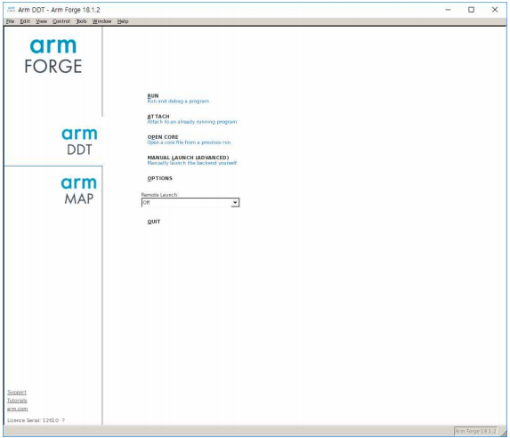
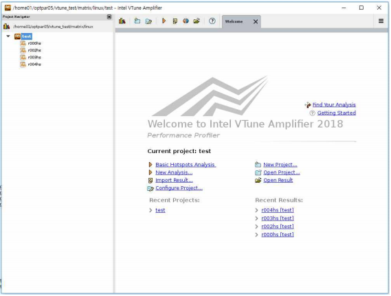
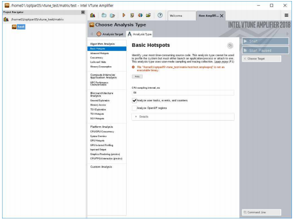
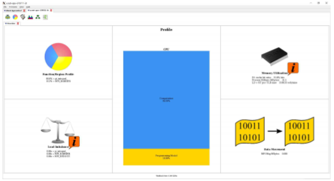
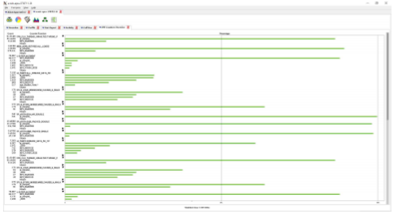

# 사용자 프로그래밍 환경

## 가. 프로그래밍 도구 설치 현황

* 컴파일러 및 라이브러리 모듈
  * &#x20;<mark style="color:red;">**Abaqus는 2023년 8월 9일로 서비스 재개되었음**</mark>

|           **구분**           |                                                                                                                                             [**항목 (이름/버전)**](#user-content-fn-1)[^1]                                                                                                                                            |                                                                                                                                                                                                                                                                                                                                                                                                                                                       |
| :------------------------: | :-----------------------------------------------------------------------------------------------------------------------------------------------------------------------------------------------------------------------------------------------------------------------------------------------------------------------------: | :---------------------------------------------------------------------------------------------------------------------------------------------------------------------------------------------------------------------------------------------------------------------------------------------------------------------------------------------------------------------------------------------------------------------------------------------------: |
|   <p>아키텍처</p><p>구분 모듈</p>  |                                                                                                                                                         ∙ craype-mic-knl                                                                                                                                                        |                                                                                                                                                                                                                  ∙ craype-x86-skylake                                                                                                                                                                                                                 |
|            컴파일러            |                                                                             <p>∙ intel/17.0.5</p><p>∙ intel/18.0.1</p><p>∙ intel/18.0.3</p><p>∙ intel/19.0.1</p><p>∙ intel/19.0.4</p><p>∙ intel/19.0.5<br>∙ intel/19.1.2<br>∙ intel/oneapi_21.2</p>                                                                             |                                                                                                                                                                      <p>∙ cce/8.6.3</p><p>∙ gcc/6.1.0</p><p>∙ gcc/7.2.0</p><p>∙ gcc/8.3.0</p><p>∙ pgi/18.10</p><p>∙ pgi/19.1</p>                                                                                                                                                                      |
| <p>컴파일러 의존</p><p>라이브러리</p> |                                                                                                                         <p>∙ hdf4/4.2.13</p><p>∙ hdf5/1.10.2</p><p>∙ lapack/3.7.0</p><p>∙ ncl/6.7.0</p>                                                                                                                         |                                                                                                                                                                                              <p>∙ ncview/2.1.7</p><p>∙ NCO/4.7.4</p><p>∙ netcdf/4.6.1</p>                                                                                                                                                                                             |
|             MPI            |                                                                                 <p>∙ impi/17.0.5</p><p>∙ impi/18.0.1</p><p>∙ impi/18.0.3</p><p>∙ impi/19.0.1</p><p>∙ impi/19.0.4</p><p>∙ impi/19.0.5<br>∙ impi/19.1.2<br>∙ impi/oneapi_21.2</p>                                                                                 |                                                                                                                                                        <p>∙ mvapich2/2.3</p><p>∙ mvapich2/2.3.1</p><p>∙ openmpi/3.1.0</p><p>∙ mvapich-verbs/2.2.ddn1.4</p><p>∙ ime/mvapich-verbs/2.2.ddn1.4</p>                                                                                                                                                       |
|  <p>MPI 의존</p><p>라이브러리</p> |                                                                                                                           <p>∙ fftw_mpi/2.1.5</p><p>∙ fftw_mpi/3.3.7</p><p>∙ hdf5-parallel/1.10.2</p>                                                                                                                           |                                                                                                                                                                                  <p>∙ netcdf-hdf5-parallel/4.6.1</p><p>∙ parallel-netcdf/1.10.0</p><p>∙ pio/2.3.1</p>                                                                                                                                                                                 |
|          상용 소프트웨어          | <p>∙ Abaqus/6.14-6</p><p>∙ Abaqus/2016</p><p>∙ Abaqus/2017</p><p>∙ Abaqus/2018</p><p>∙ Abaqus/2019</p><p>∙ Abaqus/2020</p><p>∙ Abaqus/2021</p><p>∙ Abaqus/2022</p><p>∙ Abaqus/2023</p><p>∙ gaussian/g16.a03</p><p>∙ gaussian/g16.a03.linda</p><p>∙ gaussian/g16.b01.linda</p><p>∙ gaussian/g16.c01.linda<br>∙ MATLAB/R2024a</p> | <p>∙ cfx/v145 <br>∙ cfx/v170 <br>∙ cfx/v181 <br>∙ cfx/v191 <br>∙ cfx/v192 <br>∙ cfx/v195 <br>∙ cfx/v201 <br>∙ cfx/v202</p><p>∙ cfx/v212 <br>∙ cfx/v221 <br>∙ cfx/v222 <br>∙ cfx/v231</p><p>∙ cfx/v232<br>∙ fluent/v145 <br>∙ fluent/v170 <br>∙ fluent/v181 <br>∙ fluent/v191 <br>∙ fluent/v192 <br>∙ fluent/v195 <br>∙ fluent/v201 <br>∙ fluent/v202</p><p>∙ fluent/v212 <br>∙ fluent/v221 <br>∙ fluent/v222</p><p>∙ fluent/v231<br>∙ fluent/v232</p> |
|          응용 소프트웨어          |                                 <p>∙ cp2k/5.1.0</p><p>∙ cp2k/6.1.0</p><p>∙ ferret/7.4.3</p><p>∙ forge/18.1.2</p><p>∙ grads/2.2.0</p><p>∙ gromacs/2016.4</p><p>∙ gromacs/2018.6</p><p>∙ gromacs/2020.2</p><p>∙ gromacs/5.0.6</p><p>∙ lammps/12Dec18</p><p>∙ lammps/8Mar18<br>∙ lammps/3Mar20</p>                                 |                                                                                                    <p>∙ namd/2.12</p><p>∙ namd/2.13</p><p>∙ PETSc/3.8.4</p><p>∙ python/2.7.15</p><p>∙ python/3.7</p><p>∙ python/3.9.5</p><p>∙ qe/6.1</p><p>∙ qe/6.4.1</p><p>∙ qe/6.6</p><p>∙ R/3.5.0</p><p>∙ R/4.2.1</p><p>∙ siesta/4.0.2</p><p>∙ siesta/4.1-b3</p>                                                                                                   |
|           가상화 모듈           |                                                                                                                                       <p>∙ singularity/3.6.4</p><p>∙ singularity/3.9.7</p>                                                                                                                                      |                                                                                                                                                                                <p>∙ conda/pytorch_1.0</p><p>∙ conda/tensorflow_1.13</p><p>∙ conda/intel_caffe_1.1.5</p>                                                                                                                                                                               |
|  <p>Intel</p><p>디버깅 모듈</p> |                                                                                                                  <p>∙ advisor/17.0.5</p><p>∙ advisor/18.0.1</p><p>∙ advisor/18.0.3</p><p>∙ advisor/18.0.3a</p>                                                                                                                  |                                                                                                                                                                                  <p>∙ vtune/17.0.5</p><p>∙ vtune/18.0.1</p><p>∙ vtune/18.0.2</p><p>∙ vtune/18.0.3</p>                                                                                                                                                                                 |
|           Cray 모듈          |                           <p>∙ cdt/17.10</p><p>∙ cray-ccdb/3.0.3</p><p>∙ cray-cti/1.0.6</p><p>∙ cray-fftw/3.3.6.2</p><p>∙ cray-fftw_impi/3.3.6.2</p><p>∙ cray-impi/1.1.4</p><p>∙ cray-lgdb/3.0.7</p><p>∙ cray-libsci/17.09.1</p><p>∙ craype/2.5.13</p><p>∙ craypkg-gen/1.3.5</p><p>∙ chklimit/1.0</p>                           |                                                                                       <p>∙ vapich2_cce/2.2rc1.0.3_noslurm</p><p>∙ vapich2_gnu/2.2rc1.0.3_noslurm</p><p>∙ papi/5.5.1.3</p><p>∙ perftools/6.5.2</p><p>∙ perftools-bas/6.5.2</p><p>∙ perftools-lite/6.5.2</p><p>∙ PrgEnv-cray/1.0.2</p><p>∙ libfabric/1.7.0</p><p>∙ pbs/trace</p><p>∙ pbs/tools</p>                                                                                      |
|             etc            |                                                                                    <p>∙ cmake/3.12.3</p><p>∙ cmake/3.17.4</p><p>∙ cmake/3.26.2</p><p>∙ common/memkind-1.9.0</p><p>∙ git/1.8.3.4</p><p>∙ git/2.35.1</p><p>∙ IGPROF/5.9.16</p>                                                                                    |                                                                                                                                                         <p>∙ ImageMagick/7.0.8-20</p><p>∙ perl/5.28.1</p><p>∙ qt/4.8.7</p><p>∙ qt/5.9.6</p><p>∙ subversion/1.7.19</p><p>∙ subversion/1.9.3</p>                                                                                                                                                        |

* &#x20;apps/Modules/modulefiles/test 은 test 모듈임
* &#x20;ANSYS 사용이 가능한 사용자 그룹은 대학교, 산업체(중소기업), 출연연구소에 한함.&#x20;
  * **사용 가능 사용자 그룹이 아니거나 사용 신청을 하지 않은 타 기관 사용자에 의한 ANSYS 사용은 ANSYS 사에 의해 법적 제재를 당할 수 있음에 유의하시기 바랍니다.**&#x20;
* Abaqus 사용이 가능한 사용자 그룹은 대학교, 산업체(중소기업), 출연연구소에 한함
  * **사용 가능 사용자 그룹이 아니거나 사용 신청을 하지 않은 타 기관 사용자에 의한 Abaqus 사용은 다쏘시스템코리아에 의해 법적 제재를 당할 수 있음에 유의하시기 바랍니다.**&#x20;
* Gaussian은 helpdesk 계정담당자(account@ksc.re.kr)를 통해 사용권한 신청 후 사용 가능함&#x20;
* 공통 라이브러리(예: cairo, expat, jasper, libpng, udunits 등) 설치 현황은 \[별첨 5]을 참조
* MATLAB은 사용자(소속기관)가  라이선스를  보유해야 함.  사용법은   [MATLAB 가이드](https://docs-ksc.gitbook.io/myksc/app/matlab) 참조


## 나. 컴파일러 사용법

### 1. 컴파일러 및 MPI 환경설정(modules)

#### 1) 기본 필요 모듈

사용할 계산 노드에 해당되는 모듈 하나를 반드시 추가해야 한다.


| **사용할 계산 노드** | **KNL**        | **SKL**            |
| ------------- | -------------- | ------------------ |
| 모듈명           | craype-mic-knl | craype-x86-skylake |


```shell-session
$ module load craype-mic-knl
혹은
$ module load craype-x86-skylake
```

#### 2) 모듈 관련 기본 명령어

*   사용 가능한 모듈 목록 출력

    사용할 수 있는 컴파일러, 라이브러리 등의 모듈 목록을 확인할 수 있다.

```shell-session
$ module avail
혹은 
$ module av
```

*   사용할 모듈 추가

    사용하고자 하는 컴파일러, 라이브러리 등의 모듈을 추가할 수 있다.&#x20;

    사용할 모듈들을 한번에 추가할 수 있다.

```shell-session
$ module load [module name] [module name] [module name] …
혹은
$ module add [module name] [module name] [module name] …

예)
$ module load intel/19.1.2 impi/19.1.2 python/3.7
```

*   사용 모듈 삭제

    필요 없는 모듈을 제거한다. 이 때 한번에 여러 개의 모듈을 삭제할 수 있다.

```shell-session
$ module unload [module name] [module name] [module name] ...
혹은
$ module rm [module name] [module name] [module name] ...
```

*   사용 모듈 목록 출력

    현재 설정된 모듈 목록을 확인할 수 있다.

```shell-session
$ module list
혹은
$module li
```

* 전체 사용 모듈 일괄 삭제

```shell-session
$ module purge
```

이 경우, 기본 필요 모듈도 일괄 삭제되므로, 모듈 재사용 시 기본 필요 모듈을 다시 추가해야 한다.


* 기타 module 활용 예시&#x20;
  * module help 명령 (도움말 보기)

```shell-session
$ module help [module name]
```

* module show 명령 (설정 환경변수 확인)

```shell-session
$ module show [module name]
```


### 2. 순차 프로그램 컴파일

순 프로그램은 병렬 프로그램 환경을 고려하지 않은 프로그램을 말한다. 즉, OpenMP, MPI와 같은 병렬 프로그램 인터페이스를 사용하지 않는 프로그램으로써, 하나의 노드에서 하나의 프로세서만 사용해 실행되는 프로그램이다. 순차 프로그램 컴파일 시 사용되는 컴파일러별 옵션은 병렬 프로그램을 컴파일 할 때도 그대로 사용되므로, 순차 프로그램에 관심이 없다 하더라도 참조하는 것이 좋다.

#### **1) Intel 컴파일러**

Intel 컴파일러를 사용하기 위해서 필요한 버전의 Intel 컴파일러 모듈을 추가하여 사용한다. 사용 가능한 모듈은 module avail로 확인할 수 있다.

```shell-session
$ module load intel/18.0.3
```

&#x20;※ 프로그래밍 도구 설치 현황 표를 참고하여 사용가능 버전 확인

* 컴파일러 종류

| **컴파일러**   | **프로그램** | **소스 확장자**                                             |
| ---------- | -------- | ------------------------------------------------------ |
| icc / icpc | C / C++  | .C, .cc, .cpp, .cxx,.c++                               |
| ifort      | F77/F90  | .f, .for, .ftn, .f90, .fpp, .F, .FOR, .FTN, .FPP, .F90 |


* 컴파일러 옵션

| **컴파일러 옵션**                                 | **설명**                                                                                           |
| ------------------------------------------- | ------------------------------------------------------------------------------------------------ |
| -O\[1\|2\|3]                                | 오브젝트 최적화. 숫자는 최적화 레벨                                                                             |
| -ip, ipo                                    | 프로시저 간 최적화                                                                                       |
| -qopt\_report=\[0\|1\|2\|3\|4]              | 벡터 진단 정보의 양을 조절                                                                                  |
| <p>-xCORE-AVX512<br>-xMIC-AVX512</p>        | <p>512bits 레지스터를 가진 CPU를 지원 (SKL 노드 사용 계산의 경우)<br>512bits 레지스터를 가진 MIC를 지원 (KNL노드 사용 계산의 경우)</p> |
| -fast                                       | -O3 -ipo -no-prec-div -static, -fp-model fast=2 매크로                                              |
| <p>-static/-static-intel/<br>-i_static</p>  | 공유 라이브러리를 링크하지 못하게 함                                                                             |
| <p>-shared/-shared-intel/<br>-i_dynamic</p> | 공유 라이브러리를 링크를 함                                                                                  |
| -g -fp                                      | 디버깅 정보를 생성                                                                                       |
| -qopenmp                                    | OpenMP 기반의 multi-thread 코드 사용                                                                    |
| -openmp\_report=\[0\|1\|2]                  | OpenMP 병렬화 진단 레벨 조절                                                                              |
| <p>-ax<br>-axS</p>                          | <p>특정 프로세서에 최적화된 코드를 생성<br>SIMD Extensions4(SSE4) 벡터라이징 컴파일러와 미디어 가속 명령어들을 활용하는 특화된 코드를 생성</p>   |
| -tcheck                                     | 스레드 기반의 프로그램의 분석을 활성화 함                                                                          |
| -pthread                                    | 멀티스레딩 지원을 받기 위해 pthread 라이브러리를 추가 함                                                              |
| -msse<3,4.1>,-msse3                         | Streaming SIMD Extensions 3 지원                                                                   |
| -fPIC,fpic                                  | PIC (Position Independent Code)가 되도록 컴파일                                                         |
| -p                                          | 프로파일링 정보를 생성(gmon.out)                                                                           |
| -unroll                                     | unroll활성화, 은 최대 횟수 (64비트만 지원)                                                                    |
| -mcmodel medium                             | 2GB이상의 memory allocation이 필요한 경우 사용                                                              |
| -help                                       | 옵션 목록 출력                                                                                         |


* Intel 컴파일러 사용 예제\
  다음은 **KNL 계산노드에서** test 예제파일을 intel 컴파일러로 컴파일하여 실행파일 test.exe를 만드는 예시임

<pre class="language-shell-session"><code class="lang-shell-session"><strong>$ module load craype-mic-knl intel/18.0.3
</strong>$ icc –o test.exe –O3 –fPIC –xMIC-AVX512 test.c
혹은
$ ifort -o test.exe -O3 -fPIC -xMIC-AVX512 test.f90
$ ./test.exe
</code></pre>

※ /apps/shell/home/job\_examples 에서 작업제출 test 예제파일을 복사하여 사용 가능

* 권장 옵션

| **계산노드**  | **권장옵션**                  |
| --------- | ------------------------- |
| SKL       | -O3 –fPIC –xCORE-AVX512   |
| KNL       | -O3 -fPIC -xMIC-AVX512    |
| SKL & KNL | -O3 –fPIC -xCOMMON-AVX512 |

#### **2) GNU 컴파일러**

GNU 컴파일러를 사용하기 위해서 필요한 버전의 GNU 컴파일러 모듈을 추가하여 사용한다. 사용 가능한 모듈은 module avail로 확인할 수 있다.

```shell-session
$ module load gcc/7.2.0
```

※ 프로그래밍 도구 설치 현황 표를 참고하여 사용가능 버전 확인

※ 반드시 "gcc/6.1.0" 이상 버전을 사용

* &#x20;컴파일러 종류

| **컴파일러**  | **프로그램** | **소스 확장자**                                             |
| --------- | -------- | ------------------------------------------------------ |
| gcc / g++ | C / C++  | .C, .cc, .cpp, .cxx,.c++                               |
| gfortran  | F77/F90  | .f, .for, .ftn, .f90, .fpp, .F, .FOR, .FTN, .FPP, .F90 |

* &#x20;GNU 컴파일러 옵션

| **컴파일러 옵션**                                | **설명**                                                                                            |
| ------------------------------------------ | ------------------------------------------------------------------------------------------------- |
| -O\[1\|2\|3]                               | 오브젝트 최적화. 숫자는 최적화 레벨                                                                              |
| <p>-march=skylake-avx512<br>-march=knl</p> | <p>512bits 레지스터를 가진 CPU를 지원 (SKL 노드 사용 계산의 경우)<br>512bits 레지스터를 가진 MIC를 지원 (KNL 노드 사용 계산의 경우)</p> |
| -Ofast                                     | -O3 -ffast-math 매크로                                                                               |
| -funroll-all-loops                         | 모든 루프를 unrolling함                                                                                 |
| -ffast-math                                | fast floating point model 사용                                                                      |
| -mline-all-stringops                       | 더 많은 inlining 허용, memcpy, strlen, memsetdp 의존적인 코드의 성능을 향상 시킴                                     |
| -fopenmp                                   | OpenMP 기반의 multi-thread 코드 사용                                                                     |
| -g                                         | 디버깅 정보를 생성                                                                                        |
| -pg                                        | 프로파일링 정보를 생성(gmont.out)                                                                           |
| -fPIC                                      | PIC(Position Independent Code)가 생성되도록 컴파일                                                         |
| -help                                      | 옵션 목록 출력                                                                                          |

* &#x20;GNU 컴파일러 사용 예제

다음은 **KNL 계산노드**에서 test 예제파일을 GNU 컴파일러로 컴파일하여 실행파일 test.exe를 만드는 예시임

```shell-session
$ module load craype-mic-knl gcc/7.2.0
$ gcc –o test.exe -O3 -fPIC -march=knl test.c
혹은
$ gfortran –o test.exe -O3 -fPIC -march=knl test.f90
$ ./test.exe
```

※ /apps/shell/home/job\_examples 에서 작업제출 test 예제파일을 복사하여 사용 가능

* &#x20;권장 옵션

| **계산노드**  | **권장옵션**                        |
| --------- | ------------------------------- |
| SKL       | -O3 -fPIC -march=skylake-avx512 |
| KNL       | -O3 -fPIC -march=knl            |
| SKL & KNL | -fPIC -mpku                     |

#### **3) PGI 컴파일러**

PGI 컴파일러를 사용하기 위해서 필요한 버전의 PGI 컴파일러 모듈을 추가하여 사용한다. 사용 가능한 모듈은 module avail로 확인할 수 있다.

```shell-session
$ module load pgi/18.10
```

※ 프로그래밍 도구 설치 현황 표를 참고하여 사용가능 버전 확인

* &#x20;컴파일러 종류

| **컴파일러**     | **프로그램** | **소스 확장자**                                             |
| ------------ | -------- | ------------------------------------------------------ |
| pgcc / pgc++ | C / C++  | .C, .cc, .cpp, .cxx, .c++                              |
| pgfortran    | F77/F90  | .f, .for, .ftn, .f90, .fpp, .F, .FOR, .FTN, .FPP, .F90 |

* &#x20;PGI 컴파일러 옵션

| **컴파일러 옵션**                                             | **설명**                                                                                                                                                                                               |
| ------------------------------------------------------- | ---------------------------------------------------------------------------------------------------------------------------------------------------------------------------------------------------- |
| -O\[1\|2\|3\|4]                                         | 오브젝트 최적화. 숫자는 최적화 레벨                                                                                                                                                                                 |
| -Mipa=fast                                              | 프로시저 간 최적화                                                                                                                                                                                           |
| -fast                                                   | -O2 -Munroll=c:1 -Mnoframe -Mlre –Mautoinline 의 매크로                                                                                                                                                  |
| -fastsse                                                | SSE, SSE2를 지원하는 최적화                                                                                                                                                                                  |
| -g, -gopt                                               | 디버깅 정보를 생성                                                                                                                                                                                           |
| -mp                                                     | OpenMP 기반의 multi-thread 코드 사용                                                                                                                                                                        |
| -Minfo=mp, ipa                                          | OpenMP관련 정보, 프로시저 간 최적화                                                                                                                                                                              |
| -pg                                                     | 프로파일링 정보를 생성(gmon.out)                                                                                                                                                                               |
| <p>-Mprof=time</p><p>-Mprof=func</p><p>-Mprof=lines</p> | <p>PGPROF output file 생성</p><p>- time에 기초한 명령어 단위의 프로파일링 정보를 생성, 많이 사용됨</p><p>- function 단위의 프로파일링 정보를 생성</p><p>- line 단위의 프로파일링 정보를 생성</p><p>(-Mprof=lines의 경우 overhead의 증가로 계산시간이 매우 느려질 수 있음)</p> |
| -mcmodel medium                                         | 2GB이상의 memory allocation이 필요한 경우 사용                                                                                                                                                                  |
| <p>-tp=skylake</p><p>-tp=knl</p>                        | <p>Skylake 아키텍쳐 프로세서 전용 옵션</p><p>KNL 아키텍쳐 프로세서 전용 옵션</p>                                                                                                                                             |
| -fPIC                                                   | PIC(Position Independent Code)가 생성되도록 컴파일                                                                                                                                                            |
| -help                                                   | 옵션 목록 출력                                                                                                                                                                                             |

* &#x20;PGI 컴파일러 사용 예제

다음은 **KNL 계산노드에서** test 예제파일을 PGI 컴파일러로 컴파일하여 실행파일 test.exe를 만드는 예시임

```shell-session
$ module load craype-mic-knl pgi/18.10
$ pgcc –o test.exe -fast –tp=knl test.c
혹은
$ pgfortran –o test.exe -fast –tp=knl test.f90
$ ./test.exe
```

※ /apps/shell/home/job\_examples 에서 작업제출 test 예제파일을 복사하여 사용 가능

* 권장 옵션

| **계산노드**  | **권장옵션**              |
| --------- | --------------------- |
| SKL       | -fast –tp=skylake     |
| KNL       | -fast –tp=knl         |
| SKL & KNL | -fast –tp=skylake,knl |

#### **4) Cray 컴파일러**

Cray 컴파일러를 사용하기 위해서 필요한 버전의 Cray 컴파일러 모듈을 추가하여 사용한다. 사용 가능한 모듈은 module avail로 확인할 수 있다.

```shell-session
$ module load cce/8.6.3
```

※ 프로그래밍 도구 설치 현황 표를 참고하여 사용가능 버전 확인

* &#x20;컴파일러 종류

| **컴파일러** | **프로그램** | **소스 확장자**                                             |
| -------- | -------- | ------------------------------------------------------ |
| cc / CC  | C / C++  | .C, .cc, .cpp, .cxx,.c++                               |
| ftn      | F77/F90  | .f, .for, .ftn, .f90, .fpp, .F, .FOR, .FTN, .FPP, .F90 |

* &#x20;컴파일러 옵션

| **컴파일러 옵션**          | **설명**                                          |
| -------------------- | ----------------------------------------------- |
| -O\[1\|2\|3]         | 오브젝트 최적화. 숫자는 최적화 레벨                            |
| -hcpu=mic-knl        | 512bits 레지스터를 가진 MIC를 지원                        |
| -Oipa\[0             | 1                                               |
| -hunroll\[0\|1\|2]   | Unrolling 옵션. Default 2인 경우모든 루프를 unrollinig    |
| -hfp\[0\|1\|2\|3\|4] | Floating\_Point 최적화                             |
| -h omp(default)      | OpenMP 기반의 multi-thread 코드 사용                   |
| -g \| -G0            | 디버깅 정보를 생성                                      |
| -h pic               | 2GB이상의 static memory가 필요한 경우 사용(-dynamic 함께 사용) |
| -dynamic             | 공유 라이브러리를 링크 함                                  |

* &#x20;Cray 컴파일러 사용 예제

다음은 **KNL 계산노드에서** test 예제파일을 Cray 컴파일러로 컴파일하여 실행파일 test.exe를 만드는 예시임

```shell-session
$ module load craype-mic-knl cce/8.6.3 PrgEnv-cray/1.0.2
$ cc –o test.exe –hcpu=mic-knl test.c
혹은
$ ftn –o test.exe –hcpu=mic-knl test.f90
$ ./test.exe
```

※ /apps/shell/home/job\_examples 에서 작업제출 test 예제파일을 복사하여 사용 가능

* &#x20;권장 옵션

| **계산노드**  | **권장옵션**      |
| --------- | ------------- |
| SKL       | 기본값           |
| KNL       | -hcpu=mic-knl |
| SKL & KNL | 기본값           |

※ 테스트를 위한 test.c 및 test.f90등은 **/apps/shell/home/job\_examples** 에서 확인 가능 (사용자 디렉토리로 복사하여 테스트)

※ KNL 최적화 옵션을 사용할 프로그램은 KNL debug 노드로 인터렉티브 작업 제출을 통해 접속한 후 컴파일하는 것을 권장(“스케줄러를 통한 작업실행 → 나. 작업제출 모니터링 → 2) 인터렉티브 작업제출” 참고)

### 3. 병렬 프로그램 컴파일

#### 1) OpenMP 컴파일

OpenMP는 컴파일러 지시자만으로 멀티 스레드를 활용할 수 있도록 간단하게 개발된 기법으로 OpenMP를 사용한 병렬 프로그램 컴파일 시 사용되는 컴파일러는 순차프로그램과 동일하며, 컴파일러 옵션을 추가하여 병렬 컴파일을 할 수 있는데, 현재 대부분의 컴파일러가 OpenMP 지시자를 지원한다.

| **컴파일러 옵션**              | **프로그램**          | **옵션**   |
| ------------------------ | ----------------- | -------- |
| icc / icpc / ifort       | C / C++ / F77/F90 | -qopenmp |
| gcc / g++ / gfortran     | C / C++ / F77/F90 | -fopenmp |
| cc / CC /ftn             | C / C++ / F77/F90 | -homp    |
| pgcc / pgc++ / pgfortran | C / C++ / F77/F90 | -mp      |

* &#x20;OpenMP 프로그램 컴파일 예시 (Intel 컴파일러)

다음은 **KNL 계산노드에서 openMP**를 사용하는 test\_omp 예제파일을 intel 컴파일러로 컴파일하여 실행파일 test\_omp.exe를 만드는 예시임

```shell-session
$ module load craype-mic-knl intel/18.0.3
$ icc -o test_omp.exe -qopenmp -O3 -fPIC –xMIC-AVX512 test_omp.c
혹은
$ ifort -o test_omp.exe -qopenmp -O3 -fPIC –xMIC-AVX512 test_omp.f90
$ ./test_omp.exe
```

* &#x20;OpenMP 프로그램 컴파일 예시 (GNU 컴파일러)

다음은 **KNL 계산노드에서 openMP**를 사용하는 test\_omp 예제파일을 GNU 컴파일러로 컴파일하여 실행파일 test\_omp.exe를 만드는 예시임

```shell-session
$ module load craype-mic-knl gcc/7.2.0
$ gcc -o test_omp.exe -fopenmp -O3 -fPIC -march=knl test_omp.c
혹은
$ gfortran -o test_omp.exe -fopenmp -O3 -fPIC -march=knl test_omp.f90
$ ./test_omp.exe
```

* &#x20;OpenMP 프로그램 컴파일 예시 (PGI 컴파일러)

다음은 **KNL 계산노드에서** **openMP**를 사용하는 test\_omp 예제파일을 PGI 컴파일러로 컴파일하여 실행파일 test\_omp.exe를 만드는 예시임

```shell-session
$ module load craype-mic-knl pgi/18.10
$ pgcc –o test_omp.exe -mp -fast test_omp.c
혹은
$ pgfortran –o test_omp.exe -mp -fast test_omp.f90
$ ./test_omp.exe
```

* &#x20;OpenMP 프로그램 컴파일 예시 (Cray 컴파일러)

다음은 **KNL 계산노드에서** **openMP**를 사용하는 test\_omp 예제파일을 Cray 컴파일러로 컴파일하여 실행파일 test\_omp.exe를 만드는 예시임

```shell-session
$ module load craype-mic-knl cce/8.6.3 PrgEnv-cray/1.0.2
$ cc -o test_omp.exe -homp -hcpu=mic-knl test_omp.c
혹은
$ ftn -o test_omp.exe -homp -hcpu=mic-knl test_omp.f90
$ ./test_omp.exe
```

#### 2) MPI 컴파일

사용자는 다음 표의 MPI 명령을 실행할 수 있는데, 이 명령은 일종의 wrapper로써 .bashrc를 통해 지정된 컴파일러가 소스를 컴파일하게 된다.

| **구분**        | **Intel** | **GNU**  | **PGI**   | **Cray** |
| ------------- | --------- | -------- | --------- | -------- |
| Fortran       | ifort     | gfortran | pgfortran | ftn      |
| Fortran + MPI | mpiifort  | mpif90   | mpif90    | ftn      |
| C             | icc       | gcc      | pgcc      | cc       |
| C + MPI       | mpiicc    | mpicc    | mpicc     | cc       |
| C++           | icpc      | g++      | pgc++     | CC       |
| C++ + MPI     | mpiicpc   | mpicxx   | mpicxx    | CC       |

mpicc로 컴파일을 하더라도, 옵션은 wrapping되는 본래의 컴파일러에 해당하는 옵션을 사용해야 한다.


* &#x20;MPI 프로그램 컴파일 예시 (Intel 컴파일러)

다음은 **KNL 계산노드에서** **MPI**를 사용하는 test\_mpi 예제파일을 Intel 컴파일러로 컴파일하여 실행파일 test\_mpi.exe를 만드는 예시임

```shell-session
$ module load craype-mic-knl intel/18.0.3 impi/18.0.3
$ mpiicc -o test_mpi.exe -O3 -fPIC -xMIC-AVX512 test_mpi.c
혹은
$ mpiifort -o test_mpi.exe -O3 -fPIC -xMIC-AVX512 test_mpi.f90
$ mpirun -np 2 ./test_mpi.exe
```

* &#x20;MPI 프로그램 컴파일 예시 (GNU 컴파일러)

다음은 **KNL 계산노드에서** **MPI**를 사용하는 test\_mpi 예제파일을 GNU 컴파일러로 컴파일하여 실행파일 test\_mpi.exe를 만드는 예시임

```shell-session
$ module load craype-mic-knl gcc/7.2.0 openmpi/3.1.0
$ mpicc -o test_mpi.exe -O3 -fPIC -march=knl test_mpi.c
혹은
$ mpif90 -o test_mpi.exe -O3 -fPIC -march=knl test_mpi.f90
$ mpirun -np 2 ./test_mpi.exe
```

* &#x20;MPI 프로그램 컴파일 예시 (PGI 컴파일러)

다음은 **KNL 계산노드에서** **MPI**를 사용하는 test\_mpi 예제파일을 PGI 컴파일러로 컴파일하여 실행파일 test\_mpi.exe를 만드는 예시임

```shell-session
$ module load craype-mic-knl pgi/18.10 openmpi/3.1.0
$ mpicc -o test_mpi.exe -O3 -fPIC -tp=knl test_mpi.c
혹은
$ mpifort -o test_mpi.exe -O3 -fPIC -tp=knl test_mpi.f90
$ mpirun -np 2 ./test_mpi.exe
```

* &#x20;MPI 프로그램 컴파일 예시 (Cray 컴파일러)

다음은 **KNL 계산노드에서** **MPI**를 사용하는 test\_mpi 예제파일을 Cray 컴파일러로 컴파일하여 실행파일 test\_mpi.exe를 만드는 예시임

```shell-session
$ module load craype-mic-knl cce/8.6.3 PrgEnv-cray/1.0.2
$ cc -o test_mpi.exe -hcpu=mic-knl test_mpi.c
혹은
$ ftn -o test_mpi.exe -hcpu=mic-knl test_mpi.f90
$ mpirun -np 2 ./test_mpi.exe
```


## 다. 디버거 및 프로파일러

\
5호기 누리온 시스템은 사용자의 프로그램 디버깅을 위하여 DDT를 제공한다. 또한 사용자의 프로그램 프로파일링을 위하여 Intel vtune와 CaryPat 두 가지의 프로파일러를 제공한다.

## 1. 디버거 DDT 사용예제

* 5호기 시스템에서 DDT를 사용하기 위하여 사용할 아키텍처, 컴파일러, MPI를 선택하고 DDT를 사용하기 위한 모듈까지 선택한다.

```shell-session
$ module load craype-mic-knl or craype-x86-skylake
$ module load intel/17.0.5 impi/17.0.5
$ module load forge/18.1.2
```

* 본 예제는 위와 같은 황경에서 테스트 되었다.
* DDT를 사용하기 전 사전 준비로 컴파일 시 -g -O0 옵션을 넣어 실행파일을 선택한다.

```shell-session
$ mpiicc -o test.x -g -O0 test.c
```

* 사용자의 데스크탑에서 xming 실행 및 ssh X환경 설정 완료한 후 ddt 실행 명령을 실행 한다.

```shell-session
$ ddt &
```

* 명령을 실행하여 다음과 같은 팝업 실행 창을 확인한다.



* 위 명령 중 "RUN" 을 선택하여 다음과 같이 디버깅할 파일 선택한 후 다시 새로운 팝업 창의 "RUN" 선택한다.


* 다음과 같이 선택 된 실행 파일에 대한 디버깅 모드로 진입하여 디버깅을 진행할 수 있다.


### 2. 프로파일러 Intel vtune Amplifiler 사용예제

* 본 시스템에서 프로파일러인 vtune을 사용하기 위하여 아키텍처, 컴파일러, MPI를 선택한 후 vtune을 선택하면 프로파일러를 사용 할 수 있다.

```shell-session
$ module load craype-mic-knl or craype-x86-skylake
$ module load intel/17.0.5 impi/17.0.5
$ module load vtune/17.0.5
```

본 예제는 위와 같은 환경에서 진행되었다.

* CLI 사용법
  * Intel vtune Amplifier를 CLI 모드로 실행할 때 명령어는 아래와 같은 형식이다.
* $ amplxe-cl 옵션 분석할 프로그램 실행

```shell-session
$ amplxe-cl -collect hotspots /home01/$USER/test/test.x

amplxe: Using result path '/home01/$USER/test/r000hs'
amplxe: Executing actions 75% Generating a report
Function CPUTime CPUTime:EffectiveTime CPUTime:EffectiveTime:Idle
CPUTime:EffectiveTime:Poor CPUTime:EffectiveTime:Ok CPUTime:EffectiveTime:Ideal
CPUTime:EffectiveTime:Over CPUTime:SpinTime CPUTime:OverheadTime Module Function(full)
SourceFile StartAddress
 
multiply1 21.568s 21.568s 0.176s 21.392s 0s 0s 0s 0s 0s martix.mic multiply1 multiply.c
0x401590
init_arr 0.020s 0.020s 0s 0.020s 0s 0s 0s 0s 0s matrix.mic init_arr matrix.c
0x402384
amplx: Executing actions 100% done
```

* 위와 같이 이미 컴파일 된 실행파일을 준비하여 명령어 형식에 맞게 실행 시 r000hs 디렉터리가 생성되는 것을 확인할 수 있다. 디렉터리가 생성된 것을 확인 후 리포트 생성을 위한 명령을 실행하면 아래와 같은 결과를 출력된다.

```shell-session
$ amplxe-cl -report hotspots /home01/$USER/debugger/test/r000hs
amplxe: Using result path `/home01/$USER/debugger/test/r000hs'
amplxe: Executing actions 75 % Generating a report Function CPU Time CPU Time:Effective Time CPU Time:Spin Time CPU Time:Overhead Time Module Function (Full) Source File Start Address
-------- -------- ----------------------- ------------------ ---------------------- ------ --------------- ----------- -------------
amplxe: Executing actions 100 % done 
```

* GUI 사용 결과 확인 방법
  * Intel vtune Amplifier는 GUI 모드 역시 지원한다. 여기서는 GUI를 이용한 결과 확인 방법만 설명한다.
  * 사용자의 데스크탑에서 xming 실행

`$ amplxe-gui`

* 아래의 화면에서 New Analysis 버튼을 클릭한다.



* 아래와 같은 화면이 나타나면 cpu수와 체크 확인 후 Start 버튼을 클릭하면 분석이 시작된다.



* 완료되면 다음과 같이 분석 결과가 여러 개의 탭으로 요약되어 나타난다.


.png>)

### 3. 프로파일러 Cary-Pat 사용예제

* 본 시스템에서 프로파일러인 CaryPat을 사용하기 위하여 아래와 같이 아키텍처 등 환경을 설정한 후 예제를 진행하였다.

```shell-session
$ module load craype-mic-knl or craype-x86-skylake
$ module load perftools-base/6.5.2 perftools/6.5.2
$ module load PrgEnv-cray/1.0.2 cce/8.6.3
```

* 먼저 예제에 사용될 test.c 파일을 컴파일 한다.

```shell-session
$ cc test.c
```

* 위 실행 결과로 a.out 이라는 실행파일이 생성된다.
* CaryPat으로 분석을 위하여 pat\_build를 이용하여 새로운 실행 파일을 생성한다.

```shell-session
$ pat_build -0 apa a.out
```

* 위의 실행 결과로 a.out+pat 라는 파일이 생성된다.
* 생성된 실행파일은 MPI로 작성된 파일이므로 mpirun으로 실행한다.

```shell-session
$ mpirun -np 4 ./a.out+pat
```

* 실행을 완료하면 a.out+pat+378250-3s 디렉터리가 생성되고 디렉터리 안에 xf-files/002812.xf 파일이 생긴다.

```shell-session
$ pat_report a.out+pat+378250-3s
```

* 위와 같이 pat\_report를 실행하면 a.out+pat+378250-3s 디렉터리 안에 .ap2 파일과 .apa 파일이 생성된다.

```shell-session
$ pat_build -0 a.out+pat+378250-3s/build-options.apa
```

* .apa 파일을 이용하여 다시 실행파일을 생성하면 a.out+apa 이름의 파일이 생성된다.
* 이렇게 생성된 a.out+apa 파일을 실행하면

```shell-session
$ mpirun -np 4 ./a.out+apa
```

* a.out+pat+378250-3t에 새로운 xf 파일이 생성된다.
* pat\_report를 다시 사용하여 새로운 데이터를 처리한다.

```shell-session
$ pat_report a.out+apa+378250-3t
```

* 위와 같이 실행하여 ap2 파일과 tracing 리포트를 생성한다.
* 위와 같이 수집된 데이터를 시각화 하는 방법으로 app2를 제공한다.

```shell-session
$ app2 a.out+apa+378250-3t
```

* 아래와 같이 시각화가 가능하다.



.png>)

.png>)




2023년 6월 30일에 마지막으로 업데이트되었습니다.


[^1]: 
